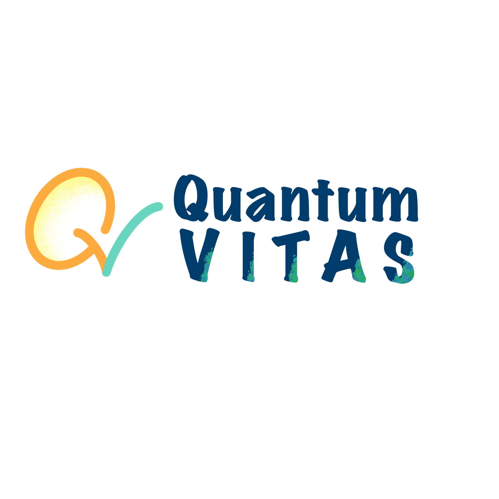
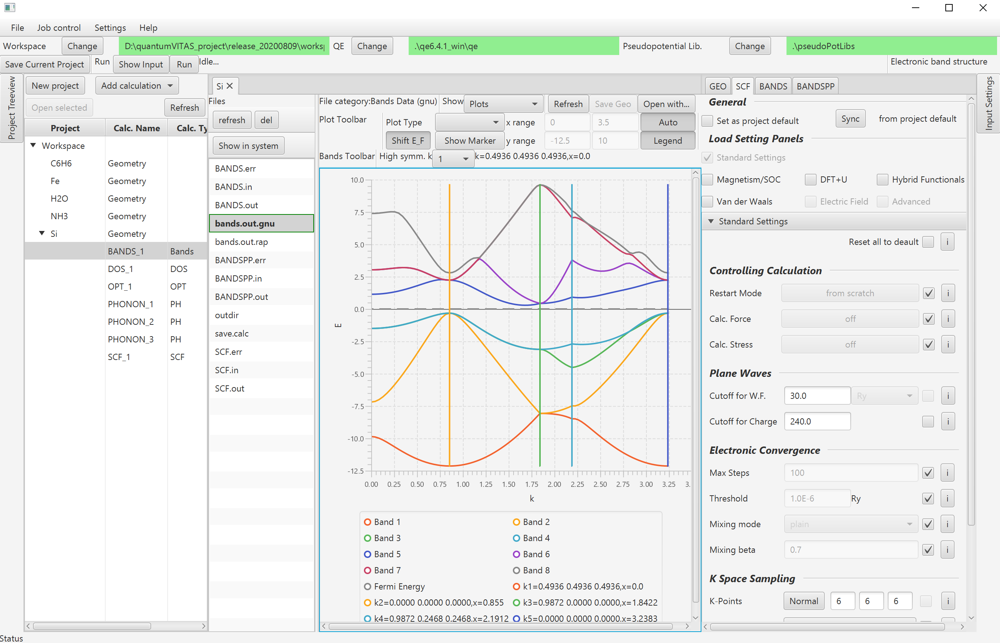

> **Status (2025)**: The original Java GUI is now in *maintenance / deprecated* mode.
> I am working on a full Python rewrite (v2) with a modern workflow engine,
> cross-platform GUI (PySide6), and easier integration with Quantum ESPRESSO,
> Wannier90, LAMMPS and online materials databases.
>
> Java v1 releases are still available below. Python v2 is under active development
> in the `v2-python` branch.



QuantumVITAS (Quantum Visualization Interactive Toolkit for Ab-initio Simulations) is a graphical user interface designed for the Quantum ESPRESSO ab-initio suite. It aims to make ab-initio simulations easily accessible and intuitively controllable across major operating systems. QuantumVITAS integrates input file generation, calculation job control, result analysis, and data management into a single interface. Additional engines beyond Quantum ESPRESSO may be integrated in the future. For more information, feel free to check out my [introduction video](https://www.youtube.com/watch?v=S2e1TWx6DHs).

[](https://www.gnu.org/licenses/gpl-3.0)

[](https://www.openhub.net/p/quantumVITAS)
[](https://travis-ci.com/quantumVITAS/quantumVITAS)
[](https://www.codacy.com/gh/quantumVITAS/quantumVITAS?utm_source=github.com&amp;utm_medium=referral&amp;utm_content=quantumVITAS/quantumVITAS&amp;utm_campaign=Badge_Grade)
[](https://codecov.io/gh/quantumVITAS/quantumVITAS)
[](https://gitter.im/quantumVITAS/quantumvitas?utm_source=badge&utm_medium=badge&utm_campaign=pr-badge&utm_content=badge)

## Download releases 

The project is actively evolving, and we have released [three early-access builds](https://github.com/quantumVITAS/quantumVITAS/releases/) with detailed feature lists. We appreciate any bug report or feature suggestion for the next milestones. Download and quick-start guides are available on the [official website](https://www.quantumvitas.org).

## Requirements

*   Java Runtime Environment (JRE) 1.8: https://java.com/en/download/
*   Windows/Linux/Mac OS

## Developer Setup (Python v2)

The Python rewrite lives under `src/quantumvitas`.  Install it in editable mode so
interactive sessions, scripts, and tests can import `quantumvitas` without manual
`sys.path` hacks:

```bash
python -m venv .venv
source .venv/bin/activate        # or .venv\Scripts\activate on Windows
pip install --upgrade pip
pip install -e .                 # add -e .[dev] to include pytest/pytest-cov
```

After the editable install you can run the quick tests directly:

```bash
python -m pytest tests/ -v --tb=short
```

Extended tests still live under `extended-tests/`; they continue to work when
invoked from the repository root and benefit from the same editable install.

### Command-Line Interface (Typer CLI)

The new runtime exposes a Typer-powered CLI named `qv`. Key commands:

> **📖 For detailed documentation with examples, see [docs/STRUCTURE_AND_CLI_USAGE.md](docs/STRUCTURE_AND_CLI_USAGE.md)**

```bash
# Create a scaffolded project (defaults to ./project1 if no path is provided)
qv init

# Or specify the target directory explicitly
qv init my_project

# Detect QE binaries/test-suite without needing a project checkout
# Detection order: QE_HOME env var → PATH → shell configs → home directory scan
qv detect-qe

# Run a QE input *or* step YAML in isolation (auto working dir + overrides)
qv run step workflows/si_dos/raw/si.1_scf.in --ecutwfc=60 --SYSTEM.degauss=0.01
qv run step workflows/si_dos/steps/nscf_1.step.yaml --workdir temp/nscf

# Import, rename, or delete structures/workflows registered in project.qv.yml
qv import-structure path/to/si.cif --id si_bulk
qv rename structure si_bulk --name "Si DOS" --path structures/si_dos.json
qv delete structure si_bulk
qv delete workflow si_dos --cascade

# Generate & run QE input directly from stored structures + overrides
qv run structure si_bulk --ecutwfc=60 --SYSTEM.degauss=0.01

# Author and edit step specs (YAML) with CLI helpers
qv init step si_bulk --workflow si_dos --type nscf --SYSTEM.ecutwfc=60
qv configure step workflows/si_dos/steps/nscf_1.step.yaml --remove --SYSTEM.tprnfor

# Execute workflows (id, slug, or explicit path); --strict enforces references
qv run workflow si_dos --strict -v

# Inspect overrides suggested by an existing QE input
qv get-command workflows/si_dos/raw/si.1_scf.in

# Lightweight analysis (energy / band / dos summaries) and metadata
qv analyze energy workflows/si_dos/raw/si.1_scf.out
qv params pw --section CONTROL
```

Overrides now cover namelists, cards, and species rows:

- `--SYSTEM.ecutwfc=60` adds/updates namelist parameters.
- `--k_points=automatic:6,6,6,0,0,0` (or `--CARD.K_POINTS.data=[[...]]`) rewrites cards.
- `--CARD.K_POINTS.rows.row1=0,0,1` edits individual mesh rows; combine with `--remove` via `qv configure step`.
- `--SPECIES.Si.mass=28.0855` / `--SPECIES.Si.pseudopot=Si.pbe-n-rrkjus_psl.1.0.0.UPF` keep pseudopotentials consistent.

Need a pre-populated layout? `qv init` exposes a `--template` flag (reserved for future bundles). By default it always creates a clean skeleton so you can wire structures and workflows manually.

`qv run workflow` automatically locates `project.qv.yml` (walking up from the
current directory). Each workflow owns a `raw/` folder where all QE input/output
data lives, so restart files persist between steps. Reference outputs belong in
`workflows/<id>/reference/`, and strict workflows compare against the files
named in `workflow.yaml`:

```yaml
id: si_dos
mode: strict
workflow:
  working_dir: raw
steps:
  - id: scf
    input: si.1_scf.in
    reference: reference/si.1_scf.out
  - id: nscf
    input: si.2_nscf.in
    reference: reference/si.2_nscf.out
  - id: dos
    input: si.3_dos.in
    reference: reference/si.3_dos.out
```

### QE Detection in CI/CD

For reliable QE detection in CI environments (GitHub Actions, etc.), always set the
`QE_HOME` environment variable. Detection priorities are:

1. `QE_HOME` environment variable (recommended for CI)
2. System PATH (`which pw.x`)
3. Shell configuration files (`~/.zshrc`, `~/.bashrc`)
4. Home directory scan (`$HOME/**/q-e-qe*`)

```yaml
# GitHub Actions example
- name: Run tests
  run: pytest tests/ -v
  env:
    QE_HOME: $HOME/src/q-e-qe-7.5
```

### Test slices

The quick suite is split into three markers:

```bash
pytest -m unit    # parser/project tests (no QE binaries)
pytest -m qe_core # QE integration via run_and_verify_step/workflow runner
pytest -m qe_cli  # QE integration driven through the Typer CLI
```

The QE parameter helper (`qv params`) is backed by the generated metadata in
`src/quantumvitas/data/qe_module_parameters.json`. Regenerate it when upgrading
QE docs via:

```bash
python tools/extract_qe_parameters.py --pretty
```

`qv run-step` accepts arbitrary `--parameter=value` overrides. Parameters are
mapped to the correct namelist using the metadata above; for ambiguous cases
provide a prefix such as `--SYSTEM.ecutrho=200`. Lists can be expressed with
Python/JSON syntax (e.g., `--k_points="[4,4,4]"`), booleans with `--flag` or
`--flag=false`.

**Structure Management:**
- `qv import-structure <file> --id <name>`: Import structures from CIF/POSCAR/QE inputs
- `qv run-structure <id-or-path>`: Generate QE input from structure and run with parameter overrides

See [docs/STRUCTURE_AND_CLI_USAGE.md](docs/STRUCTURE_AND_CLI_USAGE.md) for comprehensive examples.

`qv import-structure` ingests CIF/POSCAR/QE inputs (and more) via pymatgen,
normalises them into `structures/<id>.json`, and registers them in
`project.qv.yml`. `qv run-structure` loads those JSON structures (or an arbitrary
structure file), converts them into a QE input via
`qe_input_from_structure`, applies CLI overrides, and executes the step.

`qv run step` loads a declarative step YAML (structure id/path, calculation
type, parameters) and generates the QE input via the same helper functions. This
is useful for scripting repeatable QE steps outside full workflows.

### QE Input Roundtrip Helper

Need to parse a QE input, optionally tweak it, and regenerate the file?

```python
from pathlib import Path
from quantumvitas.io import QEInputParser

qe_input = QEInputParser.roundtrip_file(
    input_file=Path("tests/integration/ci_test_data/4_Si_DOS/si.1_scf.in"),
    output_file=Path("temp/roundtrip/si.1_scf.in"),
)

# qe_input.namelists / qe_input.cards are now available for inspection
```

`roundtrip_file` parses the original file and writes it back (default: in-place),
so you can inspect or modify the structured representation before regenerating.

## Highlighted features

Please refer to the [release page](https://github.com/quantumVITAS/quantumVITAS/releases/) for a detailed feature list. We would like to highlight the following features below:
* Calculations implemented:
    * Self-consistency (SCF)
        * Magnetism and spin orbital coupling (SOC)
        * DFT+U
        * Hybrid functionals
        * Van der Waals corrections
    * Structural optimization/relaxation (OPT)
    * Density of states (DOS)
    * Band structure (including spin polarized and SOC)
    * Molecular dynamics (Born–Oppenheimer MD)
    * Time-dependent density-functional theory (TDDFT)
    * Phonon (gamma point, DOS, dispersion, raman, dielectric constant)
    * NEB (Nudged Elastic Band) for transition energy barrier calculation
    * Projection to atomic orbitals (to each atom or to each element, also in the spin polarized case and SOC)
        * Projected DOS calculation
        * Projected band structure (fat bands)
* Parallel/multicore computing supported (both openmp and mpirun) and job control
* Visualizations:
    * 3D viewer
    * Visualizations of the output of all calculations

## Main user interface 



## License

 Copyright (c) 2025 QuantumNerd.
 
 QuantumVITAS (Quantum Visualization Interactive Toolkit for Ab-initio 
 Simulations) is free software; you can redistribute it and/or modify
 it under the terms of the GNU General Public License as published by
 the Free Software Foundation, either version 3 of the License, or
 any later version.
 
 QuantumVITAS is distributed in the hope that it will be useful,
 but WITHOUT ANY WARRANTY; without even the implied warranty of
 MERCHANTABILITY or FITNESS FOR A PARTICULAR PURPOSE.  See the
 GNU General Public License for more details.
 
 You should have received a copy of the GNU General Public License
 along with QuantumVITAS.  If not, see <https://www.gnu.org/licenses/gpl-3.0.txt>.
