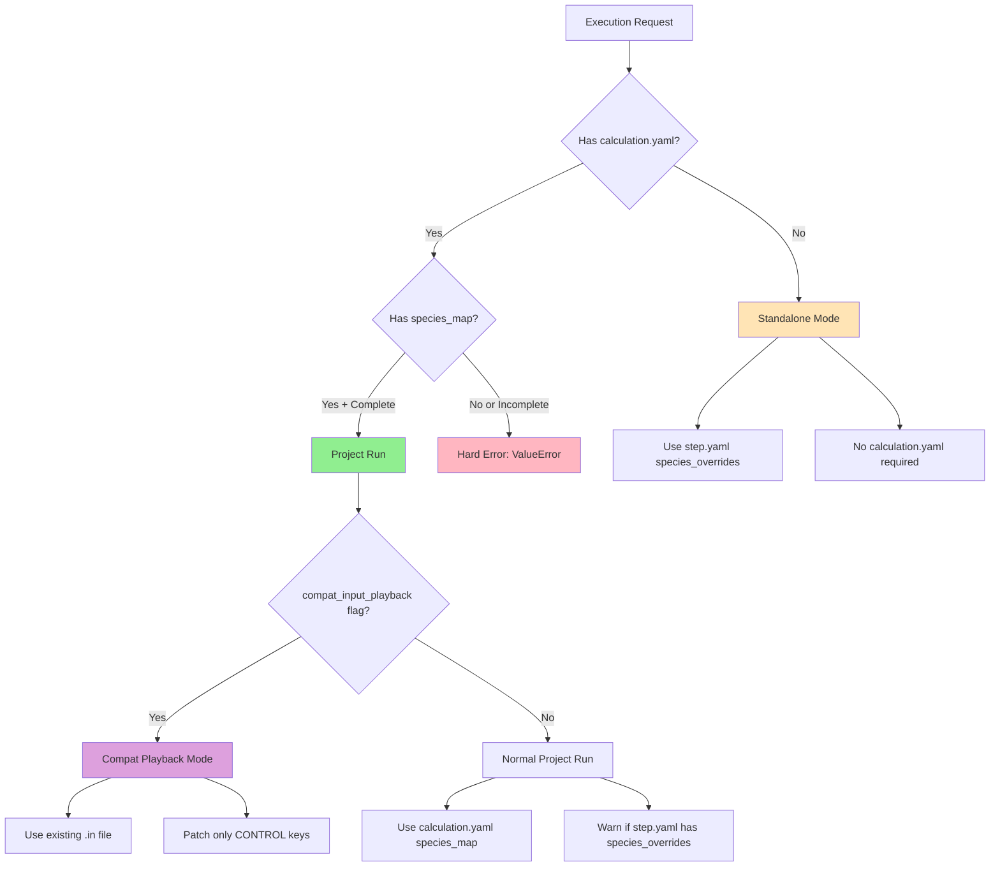

# Detour: ParamSpace Restore + Species/Pseudo SSOT + Execution Modes Contract

## 1. Purpose

This SPEC documents the system contracts established during the detour work that restored ParamSpace semantics (baac796-era) and established calculation-level `species_map` as the Single Source of Truth (SSOT) for pseudopotential configuration in project runs. The purpose is to prevent regression: future refactors MUST preserve these invariants, SSOT boundaries, execution mode contracts, and reversibility guarantees. This document is not a narrative postmortem; it is a concrete contract specification that future changes must satisfy.

## 2. Definitions

**ParamSpace**: A declarative data structure for preset compilation and detection. Each dimension (e.g., precision, magnetism, occupations) declares a ParamSpace with keys, defaults, aliases, profiles, and tolerances. ParamSpace operates on IR keys (IR is SSOT). In v0, IR keys == QE keys due to 1:1 mapping, but conceptually ParamSpace only knows about IR keys.

**Key ownership / key access enforcement**: The rule that each parameter key (section.key) belongs to exactly one ParamSpace. Enforcement prevents one ParamSpace from accessing keys owned by another, ensuring lifecycle-wide isolation. Violations raise `KeyAccessError` (defined in `src/quantumvitas/presets/paramspace.py:132`).

**Preset / IR / engine parameters**: 
- **Preset**: A named profile within a ParamSpace dimension (e.g., "high", "medium", "low" for precision).
- **IR (Intermediate Representation)**: Minimal rename/indirection layer between ParamSpace and engine-specific parameter keys. In v0, IR is QE-equivalent (1:1 mapping). IR is SSOT for ParamSpace operations.
- **Engine parameters**: Engine-specific parameter keys (e.g., QE namelist keys). QE writer converts IR to engine input.

**species_map**: Calculation-level pseudopotential mapping stored in `calculation.yaml`. Format: `{element_symbol: {mass: float, pseudopot: str, ...}}`. This is the SSOT for project runs.

**species_overrides**: Step-level pseudopotential mapping stored in `step.yaml`. Format: `{element_symbol: {pseudopot: str, mass: float}}`. Legacy/standalone-only; MUST NOT be used in project runs.

**Project run / Standalone run / Compat playback**:
- **Project run**: Normal execution path using project structure + `calculation.yaml` + `step.yaml` specs. Requires `calculation.yaml` `species_map` as SSOT.
- **Standalone run**: Debug/test-only path that runs a single `step.yaml` without a `calculation.yaml`. May use `step.yaml` `species_overrides`.
- **Compat playback**: Test-only mode for running legacy tutorial `.in` files with minimal patching (only runtime-managed CONTROL keys). Does not parse/merge full `.in` files.

## 3. ParamSpace Restore Contract (baac796 semantics)

### 3.1 What was restored and why

ParamSpace semantics were restored to baac796-era design because HEAD was "corrupted" (lost reversibility, compile ordering, and key ownership enforcement). The restored design provides:

- **Matrix bridge**: ParamSpace acts as a declarative matrix bridge between presets (profiles) and IR parameters.
- **Reversibility**: Preset detection via `match_profile()` must be reversible with compilation via `compile_profile_patch()`.
- **Key ownership isolation**: Each key belongs to exactly one ParamSpace, enforced at runtime.
- **Multi-phase compilation**: Prerequisite ParamSpaces (e.g., occupations_scheme) are compiled before dependent ones (e.g., precision) to resolve cross-space dependencies.

**Non-negotiable properties**:
- ParamSpace core semantics MUST NOT be changed; only thin adapters are allowed at boundaries.
- Key ownership enforcement MUST remain active (raises `KeyAccessError` on violations).
- Compile phases/oracle behavior MUST remain unchanged.
- Reversibility contract MUST be preserved (match → compile → match must be idempotent).

### 3.2 Key ownership enforcement

**Rule**: Each key (section.key) belongs to exactly one ParamSpace.

**Enforcement mechanism**: 
- Location: `src/quantumvitas/presets/paramspace.py:164-255`
- Registry: `_KEY_OWNERSHIP: Dict[Tuple[str, str], str]` maps `(section, key)` → `paramspace_name`
- Runtime check: `check_key_access(section, key, allow_oracle=allow_oracle)` (line 209-254)
- Error type: `KeyAccessError` (defined at line 132-163)

**Current policy**: No CI gate yet; relies on dev discipline + tests. Tests in `tests/unit/test_key_access_enforcement.py` enforce this contract. If these tests fail, the spec is violated.

**Registration**: ParamSpaces register ownership via `register_paramspace(paramspace, allow_variants=True)` (line 171-204). Duplicate ownership (except variants of the same dimension) raises `RuntimeError`.

### 3.3 Compile phases / ordering

**Concept**: Multi-phase compilation (pre/post) resolves cross-space dependencies. For example:
- **Phase 1 (Prerequisite)**: `occupations_scheme` ParamSpace is compiled first, setting `SYSTEM.occupations`.
- **Phase 2 (Dependent)**: `precision` ParamSpace is compiled after, using oracle to check if `degauss` is applicable based on `occupations`.

**Implementation**: `src/quantumvitas/presets/integration.py:apply_presets_to_step()` (line ~450-650) implements two-phase compilation:
1. Prerequisite dimensions (e.g., `OCCUPATIONS_SCHEME`, `MAGNETISM`) are compiled first.
2. Dependent dimensions (e.g., `PRECISION`) are compiled after, with oracle access to current YAML state.

**Oracle concept**:
- **What it is**: Read-only semantic prerequisite queries (`src/quantumvitas/presets/oracle.py:Oracle`).
- **What it is allowed to do**: Return small discrete values (bool / small enum) based on current IR YAML state. Example: `oracle.degauss_applicability()` returns `True` iff `SYSTEM.occupations == "smearing"`.
- **What it is NOT allowed to do**: Return preset IDs, parameter values, or access preset intention/detection results. Oracle only reads IR YAML truth (current in-memory IR state).
- **Why it exists**: Enables dependent ParamSpaces to query prerequisite state without violating key ownership (oracle queries are exempt from key access checks via `allow_oracle=True`).

**Contract**: ParamSpace core semantics (compile phases, oracle behavior) MUST NOT be changed; only thin adapters allowed at boundaries.

### 3.3.1 Phase ordering and oracle: contract surface

**Compile phase ordering contract**:
- Compile is multi-phase (pre/post). The ordering is a contract and guarded by tests.
- Prerequisite ParamSpaces MUST be compiled before dependent ones.
- Phase ordering is enforced by `src/quantumvitas/presets/integration.py:apply_presets_to_step()` (line ~450-650).
- Guardian tests: `tests/unit/test_paramspace_invariants.py` and `tests/unit/test_preset_integration.py` enforce phase ordering.
- If phase ordering changes, guardian tests MUST be updated accordingly.

**Oracle contract**:
- Oracle is a restricted information channel used to resolve cross-space dependencies without breaking key ownership.
- Oracle MUST NOT become a general cross-paramspace read/write backdoor.
- Oracle queries are read-only and return only small discrete values (bool / small enum).
- Oracle implementation: `src/quantumvitas/presets/oracle.py:Oracle` (line 18-60).
- Oracle usage: `src/quantumvitas/presets/integration.py:apply_presets_to_step()` (line ~622-629) creates oracle and passes it to `apply_invariants()`.

### 3.4 Adapter contract (QE↔IR thin layer)

**Purpose**: Thin adapter layer allows restored ParamSpace (which operates on IR keys) to work with existing IR infrastructure.

**Location**: Adapter logic exists in:
- `src/quantumvitas/presets/variants_registry.py`: Variant lookup and compilation boundaries
- `src/quantumvitas/presets/integration.py`: Integration layer that applies patches to `StepDoc`

**Contract**: 
- Adapter is a boundary layer only; no semantic drift.
- ParamSpace operates on IR YAML (IR is SSOT). In v0, IR keys == QE keys due to 1:1 mapping.
- QE writer converts IR to QE input format (e.g., boolean canonicalization: `True` → `.true.`).
- Adapter MUST NOT modify ParamSpace core semantics; it only adapts input/output formats.

### 3.4.1 Type formatting boundary (IR vs engine writer)

**Contract**: 
- ParamSpace / integration / IR patching operates in IR-native types (Python `bool`/`float`/`int`/`str`).
- Engine-specific input writers are responsible for converting those IR-native types into engine-specific canonical strings (e.g., QE `.true.`/`.false.` for booleans).
- Tests MUST enforce this boundary to avoid mixing formatting logic into ParamSpace.

**Implementation**:
- IR canonical boolean encoder: `src/quantumvitas/ir/backends/qe/mapping.py:ir_bool()` converts `True`/`False` → `.true.`/`.false.`
- QE writer: `src/quantumvitas/ir/backends/qe/mapping.py:ir_to_qe_param()` handles type conversion for QE-specific keys
- ParamSpace compile: `src/quantumvitas/presets/paramspace.py:compile_profile_patch()` writes IR-native types
- Integration layer: `src/quantumvitas/presets/integration.py:apply_presets_to_step()` applies IR patches, then QE writer converts to engine format

**Motivation**: Prevents regressions like `.true.` vs `True` mismatches by keeping formatting logic isolated to engine writers.

### 3.5 Reversibility contract

**Rule**: Preset detection is reversible with compilation. A preset is inferred only when all owned parameters match the profile across relevant steps. Any mismatch yields "custom" and stops touching those keys.

**Example (match vs custom)**:
- **Match**: If all steps have `SYSTEM.ecutwfc=60`, `SYSTEM.ecutrho=480`, and `SYSTEM.nbnd=16`, and these match the "high" precision profile, then `match_profile()` returns "high", and `compile_profile_patch()` would produce no changes (idempotent).
- **Custom**: If one step has `SYSTEM.ecutwfc=70` (not matching any profile), then `match_profile()` returns `None` (custom), and `compile_profile_patch()` MUST NOT modify `ecutwfc` for that step.

**Implementation**: 
- Match: `src/quantumvitas/presets/paramspace.py:match_profile()` (line ~484-560)
- Compile: `src/quantumvitas/presets/paramspace.py:compile_profile_patch()` (line ~650-850)

**Contract**: Match → compile → match must be idempotent. If a preset is detected, compiling it must produce no changes to the YAML state.

### 3.6 Tests as guardians

**Key tests that enforce the contract**:
- `tests/unit/test_key_access_enforcement.py`: Enforces key ownership rules
- `tests/unit/test_paramspace_invariants.py`: Enforces `apply_invariants()` behavior and compile ordering
- `tests/unit/test_paramspace_contract.py`: Enforces reversibility (match/compile idempotency)
- `tests/unit/test_preset_integration.py`: Enforces two-phase compilation and oracle usage

**Contract**: If these tests fail, the spec is violated. Future changes MUST keep these tests green.

## 4. Species/Pseudopotential SSOT Contract

### 4.1 SSOT statement (project runs)

**For project runs, ONLY `calculation.yaml: species_map` is authoritative for pseudo selection.**

**Rule**: 
- `step.yaml` `species_overrides` MUST NOT be used in project runs.
- Missing or incomplete `species_map` in `calculation.yaml` raises a hard error (`ValueError`).

**Detection**: Project run is detected when `calculation_dir and project_root and calc_model is not None` (see `src/quantumvitas/calculation/structure_steps.py:1134`).

**Enforcement location**: `src/quantumvitas/calculation/structure_steps.py:1147-1187`

### 4.2 Data model: species_map fields

**Minimum required per element**:
- `element_symbol` (string key): Element symbol (e.g., "Si", "O")
- `mass` (float): Atomic mass
- `pseudopot` (string): Pseudopotential filename (e.g., "Si.pbe-n-rrkjus_psl.1.0.0.UPF")

**Optional fields** (may be filled by staging/other pipeline if implemented):
- `pseudo_sha256` (string): SHA256 hash of pseudopotential file
- `pseudo_sha_family` (string): SHA family identifier
- `pseudo_basename` (string): Display name / file naming

**Responsibility**:
- **Configure writes**: `mass` + `pseudopot` (minimum required)
- **Staging/other pipeline MAY fill**: `pseudo_sha256`, `pseudo_sha_family`, `pseudo_basename` (only if implemented; do not invent)

**Data model location**: `src/quantumvitas/core/models.py:CalculationModel.species_map` (line ~243)

### 4.3 Step-level species_overrides policy

**Rule**: `step.yaml` MAY still contain `species_overrides` for legacy/standalone compatibility.

**In project runs**:
- `species_overrides` MUST NOT be used (ignored)
- System MUST emit a WARNING (not block)

**Exact warning string** (from `src/quantumvitas/calculation/structure_steps.py:1139-1142`):
```
"Step-level species_overrides detected in step.yaml. "
"Project runs ignore step species_overrides and use calculation.yaml species_map instead. "
"Configure species via `qv configure species ...`."
```

**Warning type**: `UserWarning` (line 1143)

### 4.4 CLI step-level species flags policy

**Rule**: CLI step creation MAY accept `--SPECIES.*` flags (legacy), but:
- System MUST warn (not block)
- System MUST instruct users to use `qv configure species ...`

**Exact warning string** (from `src/quantumvitas/cli/main.py:1193-1195`):
```
"Step-level species_overrides detected (--SPECIES.* flags). "
"Project runs ignore step-level species_overrides and use calculation.yaml species_map instead. "
"Configure species via `qv configure species ...` to set calculation-level species_map."
```

**Warning type**: `UserWarning` (line 1196)

**Spec note**: Step-level `--SPECIES.*` is legacy; allowed but warns; preferred is `qv configure species --from-input <file.in>` or `qv configure species --set "ELEMENT:MASS:PSEUDOPOT"`.

### 4.5 Shared API (single implementation)

**Shared function location**: `src/quantumvitas/calculation/species_config.py:configure_species_map()` (line 22-124)

**Consumers**:
- CLI command: `src/quantumvitas/cli/main.py:configure_species_command()` (line ~3079-3178) calls `configure_species_map()` at line 3159
- QVService method: `src/quantumvitas/api.py:QVService.configure_species_map()` (line 7984-8030) calls `configure_species_map()` at line 8016

**Contract**:
- Both CLI and QVService MUST call the shared API (`configure_species_map()`).
- Neither CLI nor QVService MAY write `calculation.yaml` directly in their own logic.
- Shared API handles: loading `calculation.yaml`, merging/extracting species data, writing back with proper locking (if implemented).

### 4.6 Recommended user workflows

**CLI workflow**:
- Configure `species_map` via `qv configure species --from-input <qe_input.in>` (extracts from ATOMIC_SPECIES)
- Or use `qv configure species --set "ELEMENT:MASS:PSEUDOPOT"` for explicit entries
- Step-level `--SPECIES.*` flags are legacy and ignored in project runs (warn only)

**Daemon/GUI workflow**:
- Configure `species_map` via `QVService.configure_species_map(project_root, calculation, from_qe_input=..., set_entries=...)`
- Both CLI and daemon/GUI use the shared API (`src/quantumvitas/calculation/species_config.py:configure_species_map()`)

**Legacy/standalone workflow**:
- Step-level `species_overrides` in `step.yaml` are standalone/legacy only
- `species_overrides` are ignored in project runs (warning emitted, data not used)
- For project runs, always use `calculation.yaml` `species_map` via the recommended workflows above

## 5. Execution Modes Contract

### 5.1 Project run (production)

**Inputs**: Project structure + `calculation.yaml` + `step.yaml` specs

**SSOT**:
- `species_map` MUST exist in `calculation.yaml` and be complete (all required elements present with non-placeholder pseudopot filenames)
- `step-level` `species_overrides` ignored (warning emitted, not used)

**Pseudo staging**:
- Runner stages required UPFs into `project/pseudo/` (only required files, not entire library)
- `CONTROL.pseudo_dir` MUST point to `project/pseudo` at runtime (runtime-managed; set during `materialize_step_spec()`)

**Failure mode**:
- Missing `species_map` → hard error (`ValueError`) with message:
  ```
  "Pseudopotential not configured for element(s): {elements_str}. "
  "Project runs require calculation.yaml species_map. step.yaml species_overrides is standalone-only. "
  "Configure using:\n"
  "  - CLI: --SPECIES.<element>.pseudopot=<filename>\n"
  "  - Or set calculation.yaml species_map"
  ```
  (from `src/quantumvitas/calculation/structure_steps.py:1152-1158`)
  **Spec note**: Error message mentions `--SPECIES.*` as legacy wording; preferred path is `qv configure species --from-input` or `qv configure species --set`.

- Incomplete `species_map` (missing element or placeholder) → hard error (`ValueError`) with similar message (line 1180-1187)

**Detection**: `is_project_run = (calculation_dir and project_root and calc_model is not None)` (line 1134)

### 5.1.1 Project-run context contract

**API contract for project run entrypoints**:
- Project run entrypoints (e.g., `QVService.run_calculation()`, `CalculationRunner.run()`) MUST provide `calc_model` (or equivalent calc context) and `project_root`.
- Entrypoints MUST pass these to `materialize_step_spec()` via `calculation_dir` and `project_root` parameters.
- If an entrypoint cannot supply required context (`calculation_dir`, `project_root`, `calc_model`), it MUST fail fast (or be considered unsupported) rather than silently downgrading to standalone behavior.

**Standalone entrypoints contract**:
- Standalone entrypoints (e.g., `run_standalone_step()`, CLI `qv run step --standalone`) MUST NOT be used for normal project `step.yaml` files.
- Standalone entrypoints are explicit debug/test modes and MUST be clearly labeled as such.
- If a standalone entrypoint is invoked on a project `step.yaml` (one that belongs to a calculation), the system SHOULD detect this and emit an appropriate warning or error.

**Implementation locations**:
- Project run detection: `src/quantumvitas/calculation/structure_steps.py:1134` (`is_project_run = (calculation_dir and project_root and calc_model is not None)`)
- Project run entrypoints: `src/quantumvitas/api.py:QVService.run_calculation()` (line ~1151), `src/quantumvitas/calculation/runner.py:CalculationRunner.run()` (line ~67)
- Standalone entrypoints: `src/quantumvitas/cli/main.py:_run_standalone_step()` (line ~1700+)

### 5.2 Standalone mode (debug/test only)

**Definition**: No `calculation.yaml`, or no `species_map` in `calculation.yaml`.

**Rule**: Standalone `step.yaml` is allowed to carry `species_overrides` because it has no calc `species_map`.

**Explicit statement**: Standalone is NOT a production CLI UX; it's debug/test only.

**Error behavior**: When standalone is invoked on a normal project `step.yaml` (one that belongs to a calculation), the system MUST detect this and emit an appropriate error. Current implementation: If `calculation_dir` exists but `species_map` is missing, project run detection fails and falls back to standalone, but this may emit warnings.

**Location**: `src/quantumvitas/calculation/structure_steps.py:1193-1199` sets `allow_step_species_overrides=not is_project_run` (project runs: False, standalone: True)

### 5.3 Compat input playback (tests/tutorial)

**Purpose**: Run legacy tutorial `.in` sequences without fully migrating everything to YAML SSOT.

**SSOT in this mode**: 
- Compat playback SSOT is the `.in` input files (tutorial/legacy files referenced in `calculation.yaml` `steps[].input`).
- `step.yaml` is NOT used as SSOT for parameter/card generation in compat mode.

**Explicit boundaries**:
- Compat playback MUST NOT re-parse or merge `step.yaml` into `.in` generation (except runtime-managed overrides if applicable).
- Pseudopotential filenames in compat mode come from `.in` `ATOMIC_SPECIES` card (not from `step.yaml` `species_overrides`).
- Even in compat mode, runtime-managed `CONTROL.pseudo_dir` MUST end up pointing to `project/pseudo` if a project directory exists.

**Behavior**:
- Only patches 3 CONTROL keys: `prefix`, `outdir`, `pseudo_dir` (runtime-managed)
- Does NOT parse/merge the full `.in` file
- Stages required UPFs into `project/pseudo/` (extracted from `ATOMIC_SPECIES` in `.in` file via minimal parsing)

**Contract**: 
- MUST be clearly labeled "compat/test only"
- MUST NOT contaminate production semantics
- MUST be explicitly opted-in via `compat_input_playback=True` flag

**Location**: 
- Executor: `src/quantumvitas/calculation/compat_executor.py:run_qe_step_from_existing_input_compat()` (line 22-285)
- Runner integration: `src/quantumvitas/calculation/runner.py:CalculationRunner.run()` accepts `compat_input_playback: bool = False` (line 140)
- Handler: `src/quantumvitas/execution/handlers.py:qe_step_handler()` checks `compat_input_playback` flag (line ~190-200)

**Current implementation verification**: 
- Executor extracts pseudopotential filenames from `.in` `ATOMIC_SPECIES` via `_extract_required_pseudos_from_atomic_species()` (line ~150-180 in `compat_executor.py`)
- Executor patches `CONTROL.pseudo_dir` to point to `project/pseudo` (line ~50-60 in `compat_executor.py`)
- Executor does NOT read `step.yaml` for pseudopotential configuration (verify)

## 6. Rationale (short)

**Why calc-level species_map SSOT**:
- Avoids multi-truth: Single authoritative source prevents conflicts between step-level and calc-level data
- Prevents step duplication: All steps in a calculation share the same pseudopotential set
- Enables deterministic staging: Runner knows exactly which UPFs to stage into `project/pseudo/`

**Why warnings not blocks for step-level legacy**:
- Compatibility with existing projects/tests that may have `species_overrides` in `step.yaml`
- Gradual migration path: Users can migrate step-by-step without breaking existing workflows
- Warnings guide users to the correct configuration path without blocking execution

**Why ParamSpace restore must be preserved**:
- Reversibility: Preset detection must be reversible with compilation (match → compile → match idempotent)
- Long-term extension: ParamSpace matrix bridge enables future preset dimensions without core changes
- Key ownership isolation: Prevents cross-space contamination and ensures lifecycle-wide isolation

## 7. Compliance Checklist

Future changes MUST satisfy:

- [ ] No new code path writes `species_map` except shared API (`src/quantumvitas/calculation/species_config.py:configure_species_map()`)
- [ ] Project runs never read `step-level` `species_overrides` (only emit warning, ignore data)
- [ ] Standalone mode is explicit and isolated (no contamination of production semantics)
- [ ] ParamSpace ownership/reversibility tests remain green (`tests/unit/test_key_access_enforcement.py`, `tests/unit/test_paramspace_invariants.py`, `tests/unit/test_paramspace_contract.py`)
- [ ] Compile phases/oracle behavior unchanged (two-phase compilation in `src/quantumvitas/presets/integration.py:apply_presets_to_step()`)
- [ ] Hard error on missing/incomplete `species_map` in project runs (no silent fallback to `step.yaml` `species_overrides`)
- [ ] Warning emitted when `step-level` `species_overrides` detected in project runs (exact strings as specified in sections 4.3 and 4.4)
- [ ] Compat playback mode is test-only and explicitly opted-in (no auto-detection)
- [ ] Tests/fixtures MUST NOT manually copy the entire pseudo library into project folders; staging must occur through the normal pipeline (`ensure_qe_pseudos()`)
- [ ] Daemon tests MUST NOT spawn the CLI as a subprocess for species configuration; they must use `QVService.configure_species_map()` API
- [ ] CLI tests MUST NOT patch `calculation.yaml` via direct YAML editing; they must use `qv configure species ...` where applicable

## 8. Execution Mode Diagram



## 9. Open Questions

- **Q1 (Verification)**: In standalone mode, what happens if a `step.yaml` belongs to a calculation (has `parent_calculation_id`) but is run standalone? Current code at `src/quantumvitas/calculation/structure_steps.py:1134` detects project run if `calculation_dir and project_root and calc_model is not None`, but standalone mode may not set these. **Verify**: Check `src/quantumvitas/cli/main.py:_run_standalone_step()` and `src/quantumvitas/calculation/structure_steps.py:1134-1199` to confirm error behavior when standalone is invoked on a project step.
- **Q2 (Verification)**: Are there any edge cases where `species_map` is partially populated (some elements missing) but not detected as incomplete? Current validation at `src/quantumvitas/calculation/structure_steps.py:1160-1187` checks for missing elements and placeholders. **Verify**: Review validation logic at lines 1160-1187 to confirm all edge cases are covered (empty dict, None values, missing keys, placeholder detection).
- **Q3 (Verification)**: The shared API `configure_species_map()` writes directly to `calculation.yaml` without explicit locking. Is this safe for concurrent access? Current implementation at `src/quantumvitas/calculation/species_config.py:122` uses `write_text()` without lock. **Verify**: Check if `calculation.yaml` writes are protected by edit locks elsewhere (e.g., `calc_edit_lock` in `src/quantumvitas/core/locking.py`) or if concurrent access is a risk.

