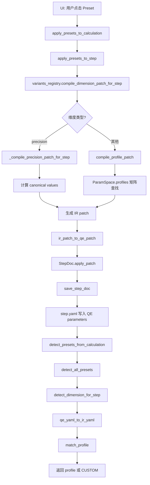
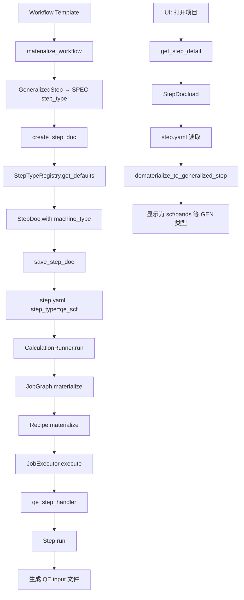

# QE 系统完整架构审查报告

**日期**: 2026-01-XX  
**审查范围**: QE 参数系统、ParamSpace、IR、GenStep、Workflow 完整调用链  
**审查类型**: 代码溯源与架构理解（只读，不修改代码）

---

## 目录

1. [两条主链路总览图](#两条主链路总览图)
2. [关键文件/模块索引表](#关键文件模块索引表)
3. [A) 参数系统实现](#a-参数系统实现)
4. [B) ParamSpace / Preset / IR](#b-paramspace--preset--ir)
5. [C) Preset 运行时行为](#c-preset-运行时行为)
6. [D) IR 的位置](#d-ir-的位置)
7. [E) Workflow → GenStep → SpecStep](#e-workflow--genstep--specstep)
8. [关键对齐点](#关键对齐点)
9. [未确认点列表](#未确认点列表)

---

## 两条主链路总览图

### 链路 1: Preset/ParamSpace → IR → Engine Parameters → 写入 YAML/Input → 反推



**关键模块入口**:
- **应用**: `src/qmatsuite/presets/integration.py:327` - `apply_presets_to_step()`
- **编译**: `src/qmatsuite/presets/variants_registry.py:260` - `compile_dimension_patch_for_step()`
- **匹配**: `src/qmatsuite/presets/paramspace.py:241` - `match_profile()`
- **IR 转换**: `src/qmatsuite/ir/backends/qe/mapping.py:188` - `qe_yaml_to_ir_yaml()`
- **存储**: `src/qmatsuite/workflow/step_factory.py:106` - `save_step_doc()`

### 链路 2: Workflow → GenStep → SpecStep → Runner 执行/落盘 → UI 反推 GenStep



**关键模块入口**:
- **Materialization**: `src/qmatsuite/workflow/generalized_steps.py:96` - `materialize_public_step_key()`
- **Registry**: `src/qmatsuite/workflow/registry.py:23` - `StepTypeSpec`
- **执行**: `src/qmatsuite/calculation/runner.py:132` - `CalculationRunner.run()`
- **反推**: `src/qmatsuite/workflow/generalized_steps.py:338` - `dematerialize_to_generalized_step()`

---

## 关键文件/模块索引表

| 文件路径 | 作用 | 关键类/函数 | 确认行为（证据） |
|---------|------|------------|----------------|
| `src/qmatsuite/presets/paramspace.py` | ParamSpace 核心定义 | `ParamSpace`, `ParamKey`, `Cell`, `match_profile()`, `compile_profile_patch()` | **证据**: 行 120-163 定义 ParamSpace 数据结构；行 241-309 实现匹配逻辑；行 316-377 实现编译逻辑 |
| `src/qmatsuite/presets/variants_registry.py` | ParamSpace 变体注册表 | `ParamSpaceVariant`, `get_variant()`, `compile_dimension_patch_for_step()`, `detect_dimension_for_step()` | **证据**: 行 17-50 定义 ParamSpaceVariant；行 245-257 实现变体查找；行 260-343 实现编译；行 460-508 实现检测 |
| `src/qmatsuite/presets/integration.py` | Preset 与计算集成 | `apply_presets_to_step()`, `detect_presets_from_calculation()` | **证据**: 行 327-568 实现 preset 应用；行 105-168 实现检测聚合 |
| `src/qmatsuite/ir/backends/qe/mapping.py` | IR ↔ QE 映射层 | `ir_to_qe_param()`, `qe_to_ir_param()`, `qe_yaml_to_ir_yaml()`, `ir_patch_to_qe_patch()` | **证据**: 行 16-44 定义 IR→QE 映射表；行 62-94 实现 IR→QE 转换；行 97-123 实现 QE→IR 转换；行 188-259 实现 YAML 转换 |
| `src/qmatsuite/core/yamldoc.py` | YAML 文档抽象 | `YamlDoc`, `StepDoc` | **证据**: 行 75-294 定义 YamlDoc；行 299-375 实现 set/delete/apply_patch |
| `src/qmatsuite/workflow/step_factory.py` | Step 创建与保存 | `create_step_doc()`, `save_step_doc()` | **证据**: 行 24-61 实现创建；行 106-118 实现保存（通过 yaml_io） |
| `src/qmatsuite/workflow/generalized_steps.py` | GenStep 定义与 materialization | `GeneralizedStep`, `materialize_public_step_key()`, `dematerialize_to_generalized_step()` | **证据**: 行 21-56 定义 GeneralizedStep 枚举；行 96-122 实现 materialization；行 338-353 实现反推 |
| `src/qmatsuite/workflow/registry.py` | Step 类型注册表 | `StepTypeSpec`, `get_registry()` | **证据**: 行 23-50 定义 StepTypeSpec；行 181-558 定义所有 step 类型 |
| `src/qmatsuite/data/qe_metadata.py` | QE 参数元数据访问 | `get_ui_parameters()`, `_load_raw_metadata()` | **证据**: 行 510-544 实现 UI 参数获取；行 90-257 实现元数据加载 |
| `src/qmatsuite/api.py` | 服务层 API | `QMSService.update_step_params()`, `QMSService.get_step_detail()` | **证据**: 行 4492-4571 实现参数更新；行 4302-4489 实现 step 详情获取 |
| `gui/src/components/panels/StepDetailPanel.tsx` | UI Step 详情面板 | `StepDetailPanel` | **证据**: 行 654-770 实现参数添加/保存逻辑 |
| `gui/src/components/step_parameters/AddParameterPalette.tsx` | UI 参数搜索添加 | `AddParameterPalette` | **证据**: 行 54-70 实现搜索与添加 |
| `src/qmatsuite/calculation/runner.py` | 计算执行器 | `CalculationRunner.run()` | **证据**: 行 132-480 实现执行逻辑 |
| `src/qmatsuite/execution/executor.py` | Job 执行器 | `JobExecutor.execute()` | **证据**: 行 75-154 实现 job 执行 |

---

## A) 参数系统实现

### A1. QE Step Detail UI 参数面实现

#### UI 分层结构

**证据位置**: `gui/src/components/panels/StepDetailPanel.tsx:538-550`

```typescript
// 行 538-550: UI 参数按 importance 排序
const sorted = [...response.data.parameters].sort((a, b) => {
  const importanceOrder: Record<string, number> = { 
    'core': 0, 'high': 0, 'medium': 1, 'advanced': 2, 'low': 2 
  };
  const aOrder = importanceOrder[a.importance || 'medium'] ?? 1;
  const bOrder = importanceOrder[b.importance || 'medium'] ?? 1;
  return aOrder - bOrder;
});
```

**结论**: 
- ✅ **UI 分层是展示层过滤**，不是底层数据结构分层
- **数据源**: `qe_ui_parameters.json` 中的 `importance` 字段（`src/qmatsuite/data/qe_metadata.py:510-544`）
- **分层规则**: 来自静态 JSON 文件，不是 schema 或运行时计算

#### 搜索添加参数

**证据位置**: 
- `gui/src/components/step_parameters/AddParameterPalette.tsx:54-70`
- `src/qmatsuite/daemon/server.py:1586-1781`

**数据源**: `qe_module_parameters.json`（通过 `list_qe_parameter_metadata` RPC）

**流程**:
1. UI 调用 `list_qe_parameter_metadata({operation: "search", query: "..."})`
2. Daemon 调用 `qe_metadata.search_parameters(query)`（`src/qmatsuite/data/qe_metadata.py`）
3. 返回匹配的参数列表
4. 用户点击 "Add" → `handleAddParameter(section, paramName)`
5. 参数写入 `step.yaml` 的 `parameters.{section}.{paramName}` 字段

**证据**: `gui/src/components/panels/StepDetailPanel.tsx:654-677`

#### 任意添加参数（不校验合法性）

**证据位置**: `src/qmatsuite/api.py:4541-4557`

```python
# 行 4541-4557: update_step_params 接受任意参数
for namelist, params in parameters.items():
    namelist_upper = namelist.upper()
    param_patch[namelist_upper] = {}
    for key, value in params.items():
        if value is None:
            param_patch[namelist_upper][key] = None  # Delete
        else:
            param_patch[namelist_upper][key] = str(value)  # 转换为字符串
```

**结论**:
- ✅ **unknown 参数存储形态**: 直接作为 `parameters.{section}.{key}` 键值对存储
- ✅ **写入方式**: 原样写入 YAML，无校验（除了类型转换为字符串）
- ✅ **排序规则**: YAML 写入时保持字典顺序（`sort_keys=False`）

### A2. QE 参数库 qeParameter*.json

#### 生成方式

**证据位置**: `tools/extract_qe_parameters_v3.py`

**生成脚本**: `tools/extract_qe_parameters_v3.py`（最新版本 v3）

**输入源**: QE HTML 文档（`INPUT_PW.html` 等）

**输出**: `src/qmatsuite/data/qe_module_parameters.json`

**生成逻辑**:
1. 解析 HTML 文档的 Table of Contents
2. 提取参数定义表（类型、默认值、描述）
3. 提取枚举值、索引模式
4. 构建层次化 section 结构
5. 输出 JSON（schema v3）

**证据**: `tools/extract_qe_parameters_v3.py:1-100`（算法摘要）

#### 消费模块

| 模块 | 用途 | 证据位置 |
|------|------|---------|
| `qe_metadata.py` | 元数据访问层 | `src/qmatsuite/data/qe_metadata.py:90-257` |
| UI (daemon) | 参数搜索/浏览 | `src/qmatsuite/daemon/server.py:1586-1781` |
| UI (frontend) | 参数搜索/添加 | `gui/src/hooks/useQEParameterMetadata.ts` |
| UI 参数列表 | 显示可编辑参数 | `src/qmatsuite/data/qe_metadata.py:510-544` |

**注意**: `qe_ui_parameters.json` 是另一个文件，用于 UI 参数重要性排序（`src/qmatsuite/data/qe_metadata.py:77-87`）

### A3. 写入与 round-trip

#### 修改参数后 YAML 变化

**证据位置**: `src/qmatsuite/api.py:4492-4571`

**调用链**:
1. UI: `update_step_params` RPC（`gui/src/components/panels/StepDetailPanel.tsx:680-770`）
2. API: `QMSService.update_step_params()`（`src/qmatsuite/api.py:4492`）
3. 加载: `StepDoc.load(step.absolute_path)`（行 4539）
4. 构建 patch: `param_patch[namelist_upper][key] = str(value)`（行 4541-4554）
5. 应用: `step_doc.apply_patch({"parameters": param_patch})`（行 4557）
6. 保存: `save_step_doc(step_doc, step.absolute_path)`（行 4571）

**YAML 变化位置**: `steps/{step_id}.step.yaml` 的 `parameters:` 字段

**证据**: `src/qmatsuite/workflow/step_factory.py:106-118` → `yaml_io.save_yaml_doc()`

#### 重开项目 UI 恢复

**证据位置**: `src/qmatsuite/api.py:4302-4489`

**调用链**:
1. UI: `get_step_detail` RPC
2. API: `QMSService.get_step_detail()`（行 4302）
3. 加载: `StepDoc.load(step_path)`（行 4340）
4. 导出: `step_doc.export_copy(["parameters"])`（行 4370）
5. 返回: `{"parameters": {...}, "cards": {...}}`

**UI 恢复逻辑**:
- **已知参数**: 从 `qe_ui_parameters.json` 获取元数据，按 `importance` 排序显示
- **未知参数**: 在 `ActiveParametersPanel` 中显示（`gui/src/components/step_parameters/ActiveParametersPanel.tsx:55-122`）
- **分层**: UI 层过滤，不是数据结构分层

**完整调用链示例**:
```
UI 修改 ecutwfc=60
  → update_step_params({parameters: {SYSTEM: {ecutwfc: "60"}}})
  → StepDoc.apply_patch({"parameters": {"SYSTEM": {"ecutwfc": "60"}}})
  → save_step_doc() → step.yaml 写入
  → [重开项目]
  → get_step_detail() → StepDoc.load() → export_copy(["parameters"])
  → UI 显示: ActiveParametersPanel 显示所有 parameters.SYSTEM 中的键值对
```

---

## B) ParamSpace / Preset / IR

### B1. ParamSpace 基本结构

#### 数据结构定义

**证据位置**: `src/qmatsuite/presets/paramspace.py:120-163`

```python
@dataclass
class ParamSpace:
    name: str
    keys: list[ParamKey] = field(default_factory=list)
    profiles: dict[str, dict[ParamKey, Cell]] = field(default_factory=dict)
```

**ParamKey 定义**（行 57-117）:
- `section`: YAML section（如 "SYSTEM", "ELECTRONS", "cards"）
- `key`: **IR 参数 key**（概念上是 IR，v0 中与 QE key 相同）
- `parser`, `canonicalizer`, `tolerance`, `aliases`, `default`

**Cell 类型**（行 24-54）:
- `VALUE(v)`: 静态值
- `NOT_APPLICABLE`: 参数不适用
- `WILDCARD`: 忽略此参数

#### Key 单归属规则

**证据位置**: `src/qmatsuite/presets/variants_registry.py:118-160`

**实现方式**: `VARIANT_BY_STEP_AND_DIMENSION` 索引表

```python
# 行 138-147: 构建索引时检测重叠
for step_type in variant.applies_to_step_types:
    key = (step_type, variant.dimension)
    if key in variant_by_step_and_dimension:
        existing = variant_by_step_and_dimension[key]
        raise ValueError(
            f"Overlap detected: Both {existing.name} and {variant.name} "
            f"apply to step_type={step_type}, dimension={variant.dimension}"
        )
```

**结论**: ✅ **单归属通过索引表唯一性保证**，导入时检测重叠并抛出异常

**注意**: 这是 **step_type + dimension** 级别的单归属，不是全局 key 单归属。同一个 key（如 `ecutwfc`）可以出现在多个 dimension 的 ParamSpace 中，但每个 `(step_type, dimension)` 组合只能有一个 variant。

#### Profile 互斥

**证据位置**: `src/qmatsuite/presets/paramspace.py:241-309`

**实现方式**: `match_profile()` 函数

```python
# 行 300-304: 检测多个 profile 匹配
if len(matching_profiles) > 1:
    raise ValueError(
        f"Multiple profiles match YAML tree: {matching_profiles}. "
        f"This is a design bug - profiles must be mutually exclusive."
    )
```

**结论**: ✅ **Profile 互斥通过匹配逻辑保证**，如果多个 profile 匹配则抛出异常

**匹配规则**（行 265-298）:
- `WILDCARD`: 跳过检查
- `NOT_APPLICABLE`: 要求 `present == False`
- `VALUE`: 比较 `effective_value` 与期望值（经过 canonicalization）

### B2. 应用域：ParamSpace 的矩阵应用于一组 steps

#### Step Selector 绑定

**证据位置**: `src/qmatsuite/presets/space_variant.py:17-50`

```python
@dataclass(frozen=True)
class ParamSpaceVariant:
    applies_to_step_types: FrozenSet[str]  # 例如: {"scf", "nscf", "relax"}
```

**结论**: ✅ **当前绑定的是 SPEC step types**（如 "scf", "nscf", "bands_pw"），不是 GenStep

**证据**: `src/qmatsuite/presets/variants_registry.py:48-100` 中定义的 step types 都是 SPEC 类型

#### ParamSpace 如何声明影响哪些 steps

**证据位置**: `src/qmatsuite/presets/variants_registry.py:42-111`

**声明方式**: `ParamSpaceVariant.applies_to_step_types` 字段

**示例**:
- `OCCUPATIONS_SCHEME_VARIANT`: `{"scf", "nscf", "relax", "vc-relax", "md", "vc-md"}`（行 48-51）
- `PRECISION_PW_DEFAULT_VARIANT`: `{"scf", "relax", "vc-relax", "md", "vc-md"}`（行 71-73）
- `PRECISION_PW_NSCF_VARIANT`: `{"nscf"}`（行 81）

#### 匹配/反推时的 "必须所有 step 都 match"

**证据位置**: `src/qmatsuite/presets/detector.py:620-665`

**实现**: `detect_all_presets()` 聚合所有 steps

```python
# 行 654-664: 对每个 dimension，从所有 steps 中检测
for dimension in dimensions:
    result[dimension] = detect_dimension_from_steps(
        steps, dimension,
        step_types=step_types,
        calculation_dir=Path(calculation_dir) if calculation_dir else None,
    )
```

**结论**: 
- ✅ **只匹配当前 calc 实际存在的 steps**
- **逻辑**: 对每个 step，查找适用的 variant，如果所有 step 都匹配同一 profile，则返回该 profile；否则返回 CUSTOM

**证据**: `src/qmatsuite/presets/detector.py:220-350` - `detect_dimension_from_steps()` 实现

### B3. Presence/Absence / Not Applicable 逻辑

**证据位置**: `src/qmatsuite/presets/paramspace.py:169-309`

#### Presence vs Effective Value

**实现**: `get_yaml_value()` 返回 `(present: bool, raw_value: Any)`

```python
# 行 169-205: get_yaml_value 返回 (present, raw_value)
def get_yaml_value(yaml_tree, section, key) -> tuple[bool, Any]:
    # 返回 (True, value) 或 (False, None)
```

**Effective Value 计算**（行 208-234）:
```python
def compute_effective_value(present, raw_value, default, canonicalizer):
    if present:
        value = raw_value
    else:
        value = default  # 使用默认值
    return canonicalizer(value)
```

#### NOT_APPLICABLE 处理

**匹配逻辑**（行 278-284）:
```python
if cell.cell_type == CellType.NOT_APPLICABLE:
    # NOT_APPLICABLE: require present == False
    if present:
        matches = False
        break
    # If not present, this key matches
    continue
```

**编译逻辑**（行 355-358）:
```python
elif cell.cell_type == CellType.NOT_APPLICABLE:
    # Always delete
    deletions.add((key.section, key.key))
    continue
```

**结论**: ✅ **"不适用"以缺席表示**，匹配时要求 `present == False`，编译时删除该 key

### B4. ParamSpace 之间的依赖与编译顺序

#### 编译顺序

**证据位置**: `src/qmatsuite/presets/integration.py:327-568`

**当前实现**: **无明确的全局编译顺序**

**应用顺序**: `apply_presets_to_step()` 中按 `options` 字典顺序处理（行 377-519）

**特殊处理**: Precision 需要 `precision_context`（lattice_matrix, base_ecutwfc, base_ecutrho），这些值来自外部（structure + pseudos），不是从其他 ParamSpace 读取

#### Oracle / 全局信息通道

**证据**: 未找到明确的 "oracle" 机制

**Precision 的特殊性**:
- Precision 的 canonical values 需要 structure + pseudos 计算（`src/qmatsuite/presets/precision.py`）
- 这些值通过 `precision_context` 参数传入（`src/qmatsuite/presets/variants_registry.py:346-457`）
- **不是从其他 ParamSpace 读取**，而是从外部数据源（structure.yaml, pseudo files）计算

#### 依赖关系示例

**未找到明确的跨维度依赖实现**

**可能的依赖**（需要进一步确认）:
- Precision 的某些参数可能依赖 occupation 是否 smearing（例如 degauss 的写入）
- **但当前代码中未找到这种依赖的显式实现**

**结论**: ⚠️ **当前系统没有显式的 ParamSpace 间依赖机制**，precision 的特殊性来自外部数据（structure/pseudos），不是从其他维度读取

---

## C) Preset 运行时行为

### C1. Preset 是否落盘

**证据位置**: `src/qmatsuite/presets/dimensions.py`（需要查看）

**结论**: ✅ **Preset 不落盘**

**证据**: 
- `detect_presets_from_calculation()` 返回运行时计算的字典（`src/qmatsuite/presets/integration.py:105-168`）
- UI 通过 `detect_presets` RPC 获取当前状态（`src/qmatsuite/daemon/server.py:3746-3792`）
- **step.yaml 中不存储 preset 选择**，只存储 QE parameters

### C2. 用户点击 preset 后发生什么

**证据位置**: `src/qmatsuite/presets/integration.py:327-568`

**流程**:
1. UI: `apply_presets_to_calculation` RPC（`gui/src/hooks/usePresets.ts:343`）
2. Daemon: `_handle_apply_presets_to_calculation()`（`src/qmatsuite/daemon/server.py:3834`）
3. Integration: `apply_presets_to_step()`（行 327）
4. 对每个 step:
   - 查找适用的 variants（`get_variant(dimension, step_type)`）
   - 编译 patch（`compile_dimension_patch_for_step()`）
   - 应用 patch（`StepDoc.apply_patch()`）
   - 保存（`save_step_doc()`）

**结论**: ✅ **立即把具体参数写入 YAML**（每个 step 的 `parameters` 字段），不是只记录选择

**证据**: 行 534-549 - patch 直接应用到 step.yaml 并保存

### C3. 反推逻辑

**证据位置**: `src/qmatsuite/presets/paramspace.py:241-309`

**匹配规则**（行 265-298）:
- 对每个 profile，检查所有 keys
- `WILDCARD`: 跳过
- `NOT_APPLICABLE`: 要求 `present == False`
- `VALUE`: 要求 `effective_value` 完全匹配（经过 canonicalization 和 tolerance）

**结论**: ✅ **只有当 profile 负责的所有参数全部完全 match 才算匹配该 profile**

**证据**: 行 266-298 - 如果任一 key 不 match，`matches = False` 并 break

#### Custom 后的行为

**证据位置**: `src/qmatsuite/presets/detector.py:620-665`

**逻辑**: 如果任一 step 的任一 dimension 不 match → 返回 CUSTOM

**结论**: ✅ **Custom 后该 dimension 退出 preset 控制**，但参数仍然保留在 step.yaml 中（不会被删除）

**粒度**: **Dimension 级别**（不是 ParamSpace 级别，因为一个 dimension 只有一个 ParamSpace）

### C4. Freeform/Unknown 参数回读

**证据位置**: `src/qmatsuite/presets/variants_registry.py:460-508`

**检测流程**:
1. `qe_yaml_to_ir_yaml()` 转换 QE YAML → IR YAML（行 496-497）
2. 只转换**已知的 IR 参数**（在 `IR_TO_QE_MAPPING` 中的）
3. `match_profile()` 只检查 ParamSpace 中定义的 keys

**结论**: 
- ✅ **Unknown 参数不参与匹配**（因为不在 IR mapping 中，不会被转换到 IR YAML）
- ✅ **一旦解析为已知参数，参与严格匹配**（如果它在 ParamSpace.keys 中）

**证据**: `src/qmatsuite/ir/backends/qe/mapping.py:188-259` - `qe_yaml_to_ir_yaml()` 只转换已知参数，unknown 参数被跳过（行 251-257）

---

## D) IR 的位置

### D1. IR 数据结构

**证据位置**: `src/qmatsuite/ir/parameters.py`

**定义**: `IRParameter` dataclass（行 14-27）

**Registry**: `IR_REGISTRY`（行 30-31，需要查看完整定义）

**结论**: ✅ **IR 数据结构存在**，但当前主要用于定义，实际使用通过 mapping 层

### D2. IR 到 QE 参数的一一对应 mapping

**证据位置**: `src/qmatsuite/ir/backends/qe/mapping.py:16-44`

**映射表**: `IR_TO_QE_MAPPING`（行 16-44）

**示例**:
- `"nspin"` → `("pw", "SYSTEM", "nspin")`
- `"ecutwfc"` → `("pw", "SYSTEM", "ecutwfc")`
- `"K_POINTS"` → `("pw", "cards", "K_POINTS")`

**结论**: ✅ **当前是 1:1 mapping**，每个 IR key 对应一个 QE (module, section, key)

**证据**: 行 16-44 定义的所有映射都是 1:1

### D3. ParamSpace/preset 到 IR 的关系

**证据位置**: `src/qmatsuite/presets/paramspace.py:57-117`

**ParamKey.key 字段**: **概念上是 IR key**（行 65-66 注释）

**实际使用**:
- ParamSpace 定义时使用 IR keys（如 `"nspin"`, `"ecutwfc"`）
- 编译时: IR patch → QE patch（`ir_patch_to_qe_patch()`）
- 检测时: QE YAML → IR YAML（`qe_yaml_to_ir_yaml()`）

**证据**: `src/qmatsuite/presets/variants_registry.py:311-343` - 编译流程中显式转换

### D4. IR 是否与 YAML 写入绑定

**证据位置**: `src/qmatsuite/workflow/step_factory.py:106-118`

**YAML 存储**: `step.yaml` 的 `parameters:` 字段存储的是 **QE parameters**，不是 IR

**结论**: ✅ **IR 只是中间态**，YAML 写入时已经转换为 QE parameters

**证据**: `src/qmatsuite/presets/variants_registry.py:319-320` - `ir_patch_to_qe_patch()` 在保存前转换

### D5. ParamSpace → (IR) → QE engine params 流转

**完整流程**:

1. **编译方向**（Preset → YAML）:
   ```
   Preset Option (enum)
     → ParamSpace.profiles[profile_name] (IR keys)
     → compile_profile_patch() (IR patch)
     → ir_patch_to_qe_patch() (QE patch)
     → StepDoc.apply_patch() (写入 step.yaml)
   ```

2. **检测方向**（YAML → Preset）:
   ```
   step.yaml (QE params)
     → qe_yaml_to_ir_yaml() (IR YAML)
     → match_profile() (匹配 IR keys)
     → profile_name → enum (Preset Option)
   ```

**证据**: 
- 编译: `src/qmatsuite/presets/variants_registry.py:311-343`
- 检测: `src/qmatsuite/presets/variants_registry.py:494-508`

---

## E) Workflow → GenStep → SpecStep

### E1. Workflow 抽象

**证据位置**: `src/qmatsuite/workflow/generalized_steps.py:1-59`

**定义**: `GeneralizedStep` 枚举（行 21-56）

**结论**: ✅ **Workflow 抽象存在**，但当前主要用于 materialization，不是持久化的 workflow 对象

**注意**: `calculation.yaml` 中存储的是 step 列表，不是 workflow 对象

### E2. GenStep 是否已存在

**证据位置**: `src/qmatsuite/workflow/generalized_steps.py:21-56`

**结论**: ✅ **GenStep 已存在**，定义为 `GeneralizedStep` 枚举

**值**: `SCF`, `NSCF`, `BANDS`, `RELAX`, `TD`, `MP2`, 等（行 24-56）

### E3. SpecStep 定义与落盘结构

**证据位置**: `src/qmatsuite/workflow/registry.py:23-50`

**定义**: `StepTypeSpec`（行 23-50）

**字段**:
- `id`: Public/generalized step_type（如 "scf"）
- `machine_type`: Machine step_type（如 "qe_scf"）
- `public_type`: 别名
- `engine`: 引擎标识（如 "qe"）

**落盘**: `step.yaml` 的 `step_type` 字段存储 `machine_type`（SPEC）

**证据**: `src/qmatsuite/workflow/step_factory.py:48-55` - 创建时使用 `machine_type`

### E4. GenStep + Engine/EngineFamily → SpecStep 映射

**证据位置**: `src/qmatsuite/workflow/generalized_steps.py:59-122`

**Materialization Map**: `MATERIALIZATION_MAP`（行 59-95）

**函数**: `materialize_public_step_key(engine_family, generalized_step)`（行 96-122）

**结论**: ✅ **映射机制已存在**

**示例**:
- `("qe", "scf")` → `"qe_scf"`
- `("orca", "scf")` → `"orca_scf"`

### E5. Runner 执行时数据来源

**证据位置**: `src/qmatsuite/calculation/runner.py:132-480`

**执行流程**:
1. `CalculationRunner.run()` 加载 calculation
2. 对每个 step，调用 `step.run(engine, ...)`
3. `step.run()` 读取 `step.spec.parameters`（QE parameters）

**结论**: ✅ **直接读 spec step 的 engine params**，不会运行时再编译 preset/IR

**证据**: `src/qmatsuite/calculation/step.py`（需要查看 `run()` 方法）

### E6. Workflow 到 Runner 调用链

**完整调用链**:

```
Workflow Template (GEN steps)
  → materialize_workflow(engine_family, generalized_steps)
  → create_step_doc(step_type=SPEC, ...)
  → save_step_doc() → step.yaml (step_type=qe_scf)
  
[执行时]
  → CalculationRunner.run()
  → JobGraph.materialize()
  → JobExecutor.execute()
  → qe_step_handler(job, calculation)
  → Step.run(engine, ...)
  → 读取 step.yaml parameters
  → 生成 QE input 文件
```

**证据**: 
- Materialization: `src/qmatsuite/workflow/generalized_steps.py:124-150`
- 执行: `src/qmatsuite/calculation/runner.py:132-480`
- Handler: `src/qmatsuite/execution/handlers.py:37-143`

---

## 关键对齐点

### 1. 现有 ParamSpace 的 step selector 是否已等同 GenStep？

**结论**: ❌ **不是**

**证据**:
- `ParamSpaceVariant.applies_to_step_types` 使用 SPEC step types（如 "scf", "nscf", "bands_pw"）
- GenStep 是枚举值（如 `GeneralizedStep.SCF`）
- 当前没有从 GenStep 到 ParamSpace 的映射

**未来迁移成本**: **中等**
- 需要将 `applies_to_step_types` 改为 GenStep 枚举
- 或者添加 GenStep → SPEC 的转换层

### 2. 现有系统是否满足：打开项目仅靠 YAML 参数状态即可唯一匹配回 ParamSpace profile/custom？

**结论**: ✅ **是**

**证据**: `detect_presets_from_calculation()` → `detect_all_presets()` → `match_profile()`

**匹配算法入口**: `src/qmatsuite/presets/paramspace.py:241` - `match_profile()`

**判定条件**:
- 所有 ParamSpace.keys 必须 match（WILDCARD 跳过，NOT_APPLICABLE 要求缺席，VALUE 要求完全匹配）
- 如果多个 profile 匹配 → 抛出异常（设计错误）
- 如果无 profile 匹配 → 返回 None → CUSTOM

**范围**: 当前 calc 实际存在的所有 steps（`detect_dimension_from_steps()` 聚合）

### 3. IR 是否真正是"隐形 glue"？

**结论**: ✅ **是**

**证据**:
- ParamSpace 内部使用 IR keys，但对外接口（YAML）都是 QE parameters
- IR 转换只在编译/检测边界进行（`ir_patch_to_qe_patch()`, `qe_yaml_to_ir_yaml()`）
- UI/存储结构不依赖 IR（只看到 QE parameters）

**结论**: ✅ **可以保持 IR 平铺不动**，只在 ORCA adapter 侧新增 mapping

### 4. 把 QE 逻辑迁移到 ORCA 的最小需要点

**观察到的事实**:

1. **UI 参数面**: 需要 ORCA 参数元数据（类似 `qe_module_parameters.json`）
2. **Writer**: 需要 ORCA input 文件生成器（类似 `generate_qe_input_from_spec()`）
3. **Parser**: 需要 ORCA output 解析器
4. **ParamSpace apply/match**: 需要 ORCA 的 IR mapping（`ir/backends/orca/mapping.py`）
5. **Engine adapter**: 需要 ORCA engine 实现（类似 `QuantumEspressoEngine`）

**最小抽象点**:
- `Engine` 抽象类（已存在：`src/qmatsuite/core/engines/base.py`）
- IR → Engine mapping 层（已存在：`src/qmatsuite/ir/backends/qe/mapping.py`，需要新增 ORCA 版本）
- ParamSpace 保持不变（使用 IR keys）

---

## 未确认点列表

### 1. ParamSpace 之间的编译顺序依赖

**状态**: ⚠️ **未完全确认**

**问题**: 是否有明确的编译顺序？precision 是否依赖 occupation 的选择？

**下一步查找线索**:
- 检查 `apply_presets_to_step()` 中是否有顺序逻辑
- 检查 precision 编译时是否读取 occupation 状态

**当前发现**: 未找到显式依赖，precision 依赖外部数据（structure/pseudos）

### 2. Unknown 参数在反推时的处理

**状态**: ✅ **已确认**

**结论**: Unknown 参数不参与匹配（因为不在 IR mapping 中）

### 3. Profile 互斥的完整性

**状态**: ✅ **已确认**

**结论**: 通过 `match_profile()` 检测多个匹配并抛出异常

### 4. Step selector 到 GenStep 的迁移路径

**状态**: ⚠️ **需要进一步设计**

**问题**: 如何将 `applies_to_step_types` 从 SPEC 迁移到 GenStep？

**下一步查找线索**:
- 检查是否有 GenStep → SPEC 的映射表
- 评估迁移影响范围

### 5. QE parameter JSON 的完整生成流程

**状态**: ✅ **已确认**

**结论**: `tools/extract_qe_parameters_v3.py` 从 HTML 生成 JSON

### 6. UI 参数分层的完整实现

**状态**: ✅ **已确认**

**结论**: 展示层过滤，基于 `qe_ui_parameters.json` 的 `importance` 字段

---

## 总结

本报告通过代码溯源确认了 QE 系统的核心架构：

1. **参数系统**: UI 分层是展示层，unknown 参数直接存储，QE 参数库从 HTML 生成
2. **ParamSpace**: 使用 IR keys 内部操作，通过 variants 绑定 SPEC step types，profile 互斥通过匹配逻辑保证
3. **Preset**: 不落盘，点击后立即写入参数，反推严格匹配所有参数
4. **IR**: 隐形 glue，只在编译/检测边界转换，YAML 存储 QE parameters
5. **GenStep**: 已存在，但 ParamSpace 尚未迁移到 GenStep

**关键发现**:
- ParamSpace 的 step selector 当前使用 SPEC types，不是 GenStep
- IR 是真正的隐形层，可以保持不动
- 迁移到 ORCA 需要新增 IR→ORCA mapping 和 ORCA engine adapter

