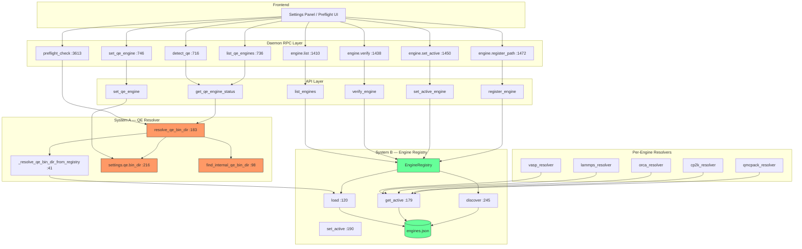
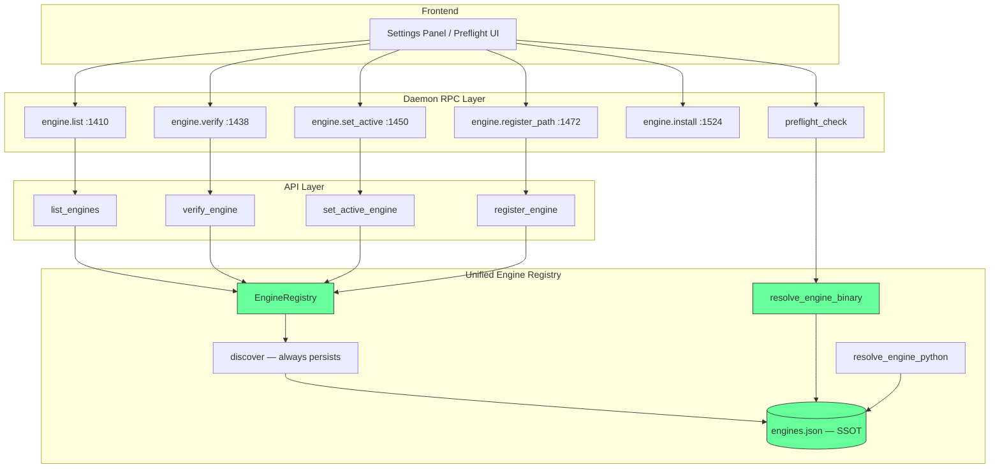

# P35 Engine Resolution Architecture Review

**Date**: 2026-02-26
**Author**: Architecture review (automated)
**Branch**: `v2-python`
**Status**: Review only — no source code changes

---

## Executive Summary

QMatSuite has two competing engine binary resolution systems that evolved independently. **System A** (QE Resolver) is a QE-specific two-state model dating from the original single-engine architecture. **System B** (Engine Registry) is a generic multi-engine distribution registry added later to support all 15 engines. After the v1.2.2 hotfix (P35), System A now consults System B first, creating a 3-state chain. But the dual system persists, causing SSOT violations, duplicated search logic, and the P35-class of bugs where the two systems disagree on paths.

This document maps both systems completely, traces every callsite, analyzes failure modes, and proposes a concrete unification plan for v1.3.

---

## Table of Contents

1. [Current State Inventory](#section-1-current-state-inventory)
2. [Callsite Census](#section-2-callsite-census)
3. [Failure Mode Analysis](#section-3-failure-mode-analysis)
4. [SSOT Violation Inventory](#section-4-ssot-violation-inventory)
5. [Unification Design](#section-5-unification-design)
6. [Risk Assessment](#section-6-risk-assessment)
7. [Decision Log](#decision-log)

---

## Section 1: Current State Inventory

### System A — QE Resolver

**Primary file**: `src/qmatsuite/drivers/qe/engine/qe_resolver.py`
**Re-export shim**: `src/qmatsuite/core/engines/qe_resolver.py`

#### Public Functions

| Function | Line | Purpose |
|----------|------|---------|
| `resolve_qe_bin_dir(settings=None)` | `:183` | Main entrypoint: returns `Path` to QE bin dir or raises `RuntimeError` |
| `find_internal_qe_bin_dir()` | `:98` | Auto-scan `engines/qe/**/bin` for directories containing `pw.x` |
| `validate_qe_bin_dir(bin_dir)` | `:64` | Validate a bin dir has `pw.x` or `pw.x.exe`; raises `RuntimeError` |
| `_resolve_qe_bin_dir_from_registry()` | `:41` | Bridge to System B; returns `Optional[Path]` |
| `home_qe_engines_dir()` | `:34` | Wrapper around `paths.home_qe_engines_dir()` with monkeypatch support |

#### 3-State Resolution Chain (post-v1.2.2)

```
resolve_qe_bin_dir(settings)
│
├── State 0 (v1.2.2+): _resolve_qe_bin_dir_from_registry()     :197
│   ├── EngineRegistry().load()                                  :46-47
│   ├── registry.get_active("qe") → active installation         :48
│   ├── active["path"] → bin_dir                                 :52-53
│   ├── validate_qe_bin_dir(bin_dir)                             :57
│   └── return bin_dir | None on any exception                   :59-61
│
├── State 1: settings.qe.bin_dir is set (external QE)           :216
│   ├── Path(settings.qe.bin_dir).resolve()                      :217
│   ├── validate_qe_bin_dir(bin_dir)                             :218
│   └── return bin_dir                                           :223
│
└── State 2: find_internal_qe_bin_dir() (auto-scan)             :226
    ├── home_qe_engines_dir() → <app_data>/engines/qe/          :115
    ├── rglob("bin") → find all bin/ dirs                        :123
    ├── Check pw.x or pw.x.exe exists                            :129-131
    ├── Sort by mtime (descending), tie-break by path            :175
    └── return candidates[0] | None                              :177-180
```

#### `home_qe_engines_dir()` — Definition and Platform Behavior

Defined at `src/qmatsuite/core/paths.py:184`:
```python
def home_qe_engines_dir() -> Path:
    return _ensure_dir(home_engines_dir() / "qe")
```

This is simply `home_engines_dir() / "qe"` — **identical base path** as System B's `_scan_bundled()`. After the v1.2.2 fix, there is no platform divergence. Both resolve to:

| Platform | Dev mode | Electron mode | Fallback |
|----------|----------|---------------|----------|
| macOS | `<repo>/.qmatsuite/engines/qe/` | `~/Library/Application Support/QMatSuite/engines/qe/` | `~/.qmatsuite/engines/qe/` |
| Windows | `<repo>/.qmatsuite/engines/qe/` | `%LOCALAPPDATA%/QMatSuite/engines/qe/` | `~/.qmatsuite/engines/qe/` |
| Linux | `<repo>/.qmatsuite/engines/qe/` | `$XDG_DATA_HOME/qmatsuite/engines/qe/` | `~/.qmatsuite/engines/qe/` |

#### `find_internal_qe_bin_dir()` Callers

| File | Line | Calling Function | Direct or Indirect |
|------|------|------------------|--------------------|
| `drivers/qe/engine/qe_resolver.py` | `:226` | `resolve_qe_bin_dir()` | Direct |
| `drivers/qe/engine/qe_diagnostics.py` | `:19` | `diagnose_qe()` (import) | Direct |
| `api/utils.py` | `:1598` | `ensure_qe_configured()` (via `home_qe_engines_dir`) | Indirect — uses same base path |

No other module calls `find_internal_qe_bin_dir()` directly.

#### `_resolve_qe_bin_dir_from_registry()` Behavior

- **Registry returns None** (no active QE installation): returns `None`, falls through to State 1/2 (`qe_resolver.py:50-51`)
- **Registry returns path that doesn't exist on disk**: `validate_qe_bin_dir()` raises `RuntimeError`, caught by bare `except Exception` at `:59`, logged at DEBUG, returns `None` — falls through to State 1/2
- **Registry returns valid path**: returns that path immediately (`:57-58`)

#### Settings Integration

`settings.qe.bin_dir` is defined in `src/qmatsuite/core/settings.py:24`:
```python
class QEConfig:
    bin_dir: Optional[str] = None  # Absolute path to QE bin directory
```

**Priority**: Registry (State 0) > Settings (State 1) > Auto-scan (State 2).

The registry and settings can conflict: if `settings.qe.bin_dir` points to `/opt/qe-7.3/bin` but the registry has `bundled-7.5` active, the registry wins. The settings value is never consulted. This is a **silent override** — the user sees "external QE set" in Settings UI but the system uses the registry's bundled QE.

---

### System B — Engine Registry

**Primary file**: `src/qmatsuite/core/engines/engine_registry.py`

#### `engines.json` Schema

Location: `<app_data>/config/engines.json` (via `home_config_dir()`, `engine_registry.py:98`)

```json
{
  "schema_version": 1,
  "engines": {
    "<engine_family>": {
      "active": "<installation_id>",
      "installations": [
        {
          "id": "bundled-7.5",
          "source": "bundled|github_release|micromamba|system_path|user_path|user_venv",
          "version": "7.5",
          "path": "/absolute/path/to/bin/dir",
          "python_executable": "/path/to/python",
          "conda_env": "env_name",
          "required_binaries": ["pw.x"],
          "env_vars": {},
          "stale": false,
          "verified": "2026-02-26T00:00:00+00:00"
        }
      ]
    }
  }
}
```

**Fields**:
- `schema_version` (int): Currently `1`. Unsupported versions log a warning but data is preserved (`engine_registry.py:140-145`).
- `engines` (dict): Keyed by engine family (15 families from `ENGINE_META`).
- `active` (string|null): `installation_id` of the active installation, or null.
- `installations` (list[dict]): All known installations for this engine.
  - `id` (string): Unique identifier (e.g., `bundled-7.5`, `conda-xtb`, `system-pw.x`, `user-<sha1>`).
  - `source` (string): One of `bundled`, `github_release`, `micromamba`, `system_path`, `user_path`, `user_venv`.
  - `version` (string|null): Detected version string.
  - `path` (string): Absolute path to bin directory (binary engines).
  - `python_executable` (string): Absolute path to Python (Python engines).
  - `conda_env` (string): Conda environment name (micromamba installs).
  - `required_binaries` (list[string]): Binary names needed for verification.
  - `env_vars` (dict): Environment variables to set at runtime.
  - `stale` (bool): Set when a previously-discovered installation is no longer found.
  - `verified` (string|null): ISO timestamp of last successful verification.

#### `discover()` — Scan Tiers

`discover()` at `engine_registry.py:245` iterates over all 15 engines in `ENGINE_META` and runs three scanners per engine:

**Tier 1 — `_scan_bundled()`** (`engine_registry.py:339`):
- Only for `engine_type == "binary"` engines.
- Base path: `home_engines_dir() / engine_family` (`:345`).
- Special case: Wannier90 (`w90`) also scans inside QE bundles (`:351-354`).
- Iterates subdirectories, looks for `<subdir>/bin/<detection_binary>`.
- Source tagging: `github-*` prefix → `"github_release"`, otherwise `"bundled"`.
- Extracts version hint from directory name via regex (`:471-473`).

**Tier 2 — `_scan_micromamba()`** (`engine_registry.py:382`):
- Scans `<app_data>/micromamba/envs/*/` for conda-installed engines.
- For Python engines: checks `import <module>; print(__version__)`.
- For binary engines: checks `<env>/bin/<detection_binary>` or `<env>/Scripts/<binary>`.

**Tier 3 — `_scan_system_path()`** (`engine_registry.py:442`):
- Only for `engine_type == "binary"` engines.
- Uses `shutil.which()` for each detection binary.
- Returns only the first match.

**Merge logic** (`_merge_installations()`, `:308`):
1. User-managed entries (`user_path`, `user_venv`) are always preserved.
2. Discovered entries replace matching existing discovered entries.
3. Old discovered entries not found in new scan are marked `stale=True`.
4. Deduplication by `(source, path, python_executable, conda_env)` key.

**Post-merge**: Each installation is verified (`_verify_installation()`, `:475`), and `_pick_active()` selects the best active installation using source priority:
`user_path > user_venv > bundled > micromamba > github_release > system_path` (`:24-31`).

#### `persist=True` vs `persist=False`

| Caller | `persist` | Location |
|--------|-----------|----------|
| `api/engines.py:list_engines()` | `True` | `:88` (on cache miss or refresh) |
| `api/engines.py:discover_registry()` | `True` | `:682` (module-level function) |
| `engine_registry.py:resolve_active_binary()` | Depends on `auto_discover` | `:660-663` |
| All others (load-only) | N/A | No discover call |

**Consequence of `persist=False`**: The discovery result exists only in the `EngineRegistry._data` in-memory dict. It is lost when the object is garbage-collected. Since `EngineRegistry` is instantiated fresh on every call (no singleton), `persist=False` effectively means the result is ephemeral and single-use.

Before v1.2.2, `api/engines.py:list_engines()` called `discover(persist=False)`, meaning bundled QE found during discovery was invisible to the QE resolver (which instantiates its own `EngineRegistry` and calls `load()` — reading only the persisted file). **The v1.2.2 fix changed this to `persist=True`** (`bc2025a3`).

#### `get_active()` / `set_active()` — Activation Model

`get_active(engine_family)` at `:179`:
- Returns the installation dict matching `active` ID, or `None` if no active or ID not found.
- **If active_id points to a removed installation**: returns `None` (no auto-repair, no error).

`set_active(engine_family, installation_id)` at `:190`:
- Validates that installation_id exists in the installations list.
- Returns `False` if not found (no error raised).
- Persists immediately via `save()`.

#### Thread Safety

`save()` at `:159` uses write-to-tmp-then-rename (`engines.json.tmp` → `engines.json`). On POSIX, `Path.replace()` is atomic at the filesystem level. On Windows, it is not guaranteed atomic but is best-effort.

**Race condition**: Two concurrent `EngineRegistry` instances can both `load()`, modify in memory, and `save()`. The last writer wins. There is no file locking.

In practice, daemon RPC calls are serialized through the event loop (single-threaded asyncio), so concurrent `engine.list` and `engine.set_active` don't race in normal operation. However, if the daemon serves multiple simultaneous WebSocket connections (e.g., two browser tabs), the async handlers could interleave.

---

### Shared Infrastructure — `src/qmatsuite/core/paths.py`

#### `home_engines_dir()` vs `home_qe_engines_dir()`

```python
# paths.py:163
def home_engines_dir() -> Path:
    return _ensure_dir(get_app_data_dir() / "engines")

# paths.py:184
def home_qe_engines_dir() -> Path:
    return _ensure_dir(home_engines_dir() / "qe")
```

These are **not** aliases — `home_qe_engines_dir()` is `home_engines_dir() / "qe"`. After v1.2.2, both systems use the same base. There are **no remaining platform divergences** between the two path functions.

#### `_ensure_dir()`

`paths.py:23`: Creates directories eagerly on every call (`mkdir(parents=True, exist_ok=True)`). This means calling `home_engines_dir()` creates `<app_data>/engines/` even if no engine is installed.

On macOS, creating directories under `~/Library/Application Support/` does **not** trigger TCC prompts (this is a standard app data location). However, creating directories under `~/Documents/` or `~/Desktop/` would.

---

### Per-Engine Resolver Inventory

Every non-QE binary engine has its own resolver in `src/qmatsuite/core/engines/`. All follow the same pattern: **registry first, then engine-specific fallbacks**.

| Engine | Resolver File | Registry Call | Fallback Chain |
|--------|---------------|---------------|----------------|
| **VASP** | `vasp_resolver.py:56` | `resolve_active_binary("vasp", ...)` at `:22` | Env var → managed dir scan → `shutil.which()` |
| **LAMMPS** | `lammps_resolver.py:33` | `resolve_active_binary("lammps", ...)` at `:25` | Env var → Homebrew → Linuxbrew → apt → Conda → PATH |
| **ORCA** | `orca_resolver.py:51` | `resolve_active_binary("orca", ...)` at `:69` | Env var → bundled dir scan |
| **CP2K** | `cp2k_resolver.py:10` | `resolve_active_binary("cp2k", ...)` at `:27` | Env var → PATH → Homebrew |
| **QMCPACK** | `qmcpack_resolver.py:56` | `resolve_active_binary("qmcpack", ...)` at `:77` | Env var → managed dir scan → Conda → system paths → PATH |
| **QE** | `qe_resolver.py:183` | `_resolve_qe_bin_dir_from_registry()` at `:197` | `settings.qe.bin_dir` → `find_internal_qe_bin_dir()` |

**Key observation**: QE is the **only** engine with a settings-file fallback (`settings.qe.bin_dir`). All other engines skip directly from registry to environment/filesystem scanning.

---

## Section 2: Callsite Census

### System A (QE Resolver) Callsites

| # | File | Line | Calling Function | System | What Caller Does With Result | Fallback on Failure |
|---|------|------|------------------|--------|------------------------------|---------------------|
| A1 | `api/utils.py` | `:1537` | `get_qe_engine_status()` | A | Populates detection dict for GUI | try/except → returns `found=False` |
| A2 | `api/utils.py` | `:1589` | `ensure_qe_configured()` | A | Validates QE is available | Raises RuntimeError |
| A3 | `api/utils.py` | `:1728` | `set_qe_engine()` | A (validate only) | Validates user-provided path | Raises RuntimeError |
| A4 | `api/service.py` | `:6775` | `preflight()` | A | Check 1: QE installation | try/except → appends error |
| A5 | `drivers/qe/engine/qe_engine.py` | `:126` | `_run()` | A | Resolves bin dir before subprocess | Raises RuntimeError |
| A6 | `drivers/qe/engine/qe_binary_locator.py` | `:35` | `locate_qe_bin()` | A | Returns None on failure | Returns None (no exception) |
| A7 | `drivers/qe/engine/qe_diagnostics.py` | `:72` | `diagnose_qe()` | A | Diagnostic status | try/except → includes in report |
| A8 | `core/engines/qmcpack_resolver.py` | `:176` | `resolve_pw2qmcpack_bin()` | A | Finds pw2qmcpack.x alongside QE | try/except → falls through |

### System B (Engine Registry) Callsites

| # | File | Line | Calling Function | System | What Caller Does With Result | Fallback on Failure |
|---|------|------|------------------|--------|------------------------------|---------------------|
| B1 | `api/engines.py` | `:86-92` | `list_engines()` | B | Load or discover → list status | discover on empty cache |
| B2 | `api/engines.py` | `:129` | `get_active_engine()` | B | Return active installation dict | Returns None |
| B3 | `api/engines.py` | `:135` | `set_active_engine()` | B | Switch active installation | Returns False |
| B4 | `api/engines.py` | `:141` | `verify_engine()` | B | Verify binary exists + permissions | Returns (False, reason) |
| B5 | `api/engines.py` | `:155` | `register_engine()` | B | Add user path to registry | Raises ValueError |
| B6 | `api/engines.py` | `:196` | `unregister_engine()` | B | Remove installation entry | Returns False |
| B7 | `core/engines/vasp_resolver.py` | `:22` | `_get_registry_vasp_bin()` | B | First check in VASP resolution | Returns None → fallback chain |
| B8 | `core/engines/lammps_resolver.py` | `:25` | `_get_registry_lammps_bin()` | B | First check in LAMMPS resolution | Returns None → fallback chain |
| B9 | `core/engines/orca_resolver.py` | `:69` | `resolve_orca_bin()` | B | First check in ORCA resolution | Returns None → fallback chain |
| B10 | `core/engines/cp2k_resolver.py` | `:27` | `find_cp2k_executable()` | B | First check in CP2K resolution | Returns None → fallback chain |
| B11 | `core/engines/qmcpack_resolver.py` | `:77` | `resolve_qmcpack_bin()` | B | First check in QMCPACK resolution | Returns None → fallback chain |
| B12 | `core/engines/qmcpack_resolver.py` | `:154` | `resolve_pw2qmcpack_bin()` | B | Registry check for QE companion | Returns None → fallback chain |
| B13 | `drivers/qe/engine/qe_resolver.py` | `:44-48` | `_resolve_qe_bin_dir_from_registry()` | B (from A) | Bridge: QE resolver → registry | Returns None → legacy chain |

### Daemon RPC Handlers

| # | RPC | Handler | Line | Calls System | Notes |
|---|-----|---------|------|--------------|-------|
| D1 | `detect_qe` | `_handle_detect_qe` | `:716` | A (via `get_qe_engine_status`) | Legacy QE-specific |
| D2 | `list_qe_engines` | `_handle_list_qe_engines` | `:736` | A (via `get_qe_engine_status`) | Legacy QE-specific |
| D3 | `set_qe_engine` | `_handle_set_qe_engine` | `:746` | A (via `set_qe_engine`) | Legacy QE-specific |
| D4 | `engine.list` | `_handle_engine_list` | `:1410` | B (via `api/engines.py`) | Generic — all 15 engines |
| D5 | `engine.verify` | `_handle_engine_verify` | `:1438` | B | Generic |
| D6 | `engine.set_active` | `_handle_engine_set_active` | `:1450` | B | Generic |
| D7 | `engine.register_path` | `_handle_engine_register_path` | `:1472` | B | Generic |
| D8 | `engine.unregister` | `_handle_engine_unregister` | `:1502` | B | Generic |
| D9 | `engine.install` | `_handle_engine_install` | `:1524` | B | Generic — async job |
| D10 | `engine.uninstall` | `_handle_engine_uninstall` | `:1585` | B | Generic — async job |
| D11 | `engine.list_installable` | `_handle_engine_list_installable` | `:1396` | B | Generic |
| D12 | `engine.fix_permissions` | `_handle_engine_fix_permissions` | `:1403` | B | Generic |
| D13 | `preflight_check` | `_handle_preflight_check` | `:3613` | A (QE-specific preflight) | Uses `resolve_qe_bin_dir` |

### Frontend RPC Calls

| # | RPC | Frontend File | Line | Notes |
|---|-----|---------------|------|-------|
| F1 | `engine.list` | `useQMSClient.ts` | `:404` | Settings panel engine list |
| F2 | `engine.list_installable` | `useQMSClient.ts` | `:409` | Install dialog |
| F3 | `engine.install` | `useQMSClient.ts` | `:417` | Install button |
| F4 | `engine.uninstall` | `useQMSClient.ts` | `:430` | Uninstall button |
| F5 | `engine.verify` | `useQMSClient.ts` | `:439` | Verify button |
| F6 | `engine.fix_permissions` | `useQMSClient.ts` | `:444` | Fix permissions button |
| F7 | `engine.set_active` | `useQMSClient.ts` | `:449` | Switch active installation |
| F8 | `engine.register_path` | `useQMSClient.ts` | `:461` | Register custom path |

### Test Coverage

| Test File | System Tested | # Tests |
|-----------|---------------|---------|
| `tests/core/test_qe_resolver.py` | A | 8 |
| `tests/unit/test_engine_registry_distribution.py` | B | ~50 |
| `tests/unit/test_api_engine_registry.py` | B (API layer) | ~20 |
| `tests/unit/test_api_engine_installation.py` | B (install) | ~15 |
| `tests/unit/test_engine_installer.py` | B (installer) | ~15 |
| `tests/unit/test_engine_discovery.py` | B (discovery) | ~10 |
| `tests/daemon/contract/test_engine_rpcs.py` | B (RPC) | 14 |
| `tests/unit/test_vasp_registry.py` | B (VASP resolver) | ~10 |
| `tests/drivers/qmcpack/test_qmcpack_driver.py` | B (QMCPACK resolver) | ~10 |
| `tests/daemon/test_qe_detection.py` | A (detection) | ~5 |

**Gap**: No integration test verifies that Systems A and B agree on the same QE binary. The two systems are tested in isolation.

---

## Section 3: Failure Mode Analysis

### Scenario 1: First Startup, No `engines.json`

**Sequence**:
1. User launches QMatSuite for the first time.
2. Frontend calls `engine.list` RPC → `_handle_engine_list` (daemon `server.py:1410`).
3. `api/engines.py:list_engines()` calls `EngineRegistry().load()` (`:90`).
4. `load()` checks `engines.json` existence → not found → returns `_default_data()` (`:125-127`).
5. `data.get("engines")` returns `{}` → empty → triggers `registry.discover(persist=True)` (`:91-92`).
6. `discover()` scans bundled/micromamba/PATH for all 15 engines and writes `engines.json`.
7. User sees engine list with discovered installations.

**Separately**, if user clicks "Run" before `engine.list` completes:
1. `preflight_check` → `resolve_qe_bin_dir()` → `_resolve_qe_bin_dir_from_registry()`.
2. `EngineRegistry().load()` → no file → default empty data → `get_active("qe")` returns `None`.
3. Falls through to State 1 (`settings.qe.bin_dir`) → typically None.
4. Falls through to State 2 (`find_internal_qe_bin_dir()`) → scans filesystem.
5. If bundled QE exists on disk, it's found. If not, raises RuntimeError.

**Failure point**: Between steps 2-3, System A finds nothing in the registry. But if Electron has already staged the bundled QE to disk, `find_internal_qe_bin_dir()` catches it at State 2. **No user-visible failure** in this case, but the QE resolver silently bypasses the registry.

### Scenario 2: Bundled QE Present but `engines.json` Missing/Deleted

**Self-healing path**:
1. Next `engine.list` call with `refresh=False` → `EngineRegistry().load()` → empty → triggers discover.
2. `_scan_bundled("qe")` finds the bundled QE at `<app_data>/engines/qe/bundled-7.5/bin/pw.x`.
3. Adds installation entry, sets active, persists.
4. **Recovery time**: One `engine.list` RPC call (sub-second).

**Meanwhile**: QE resolver (`resolve_qe_bin_dir`) still finds QE via State 2 (`find_internal_qe_bin_dir`) because it scans the same directory. The user never notices.

### Scenario 3: User's `settings.qe.bin_dir` Points to Custom QE, Registry Disagrees

**Setup**: User set `settings.qe.bin_dir = /opt/qe-7.3/bin` via legacy `set_qe_engine` RPC. Later, the registry was populated with `bundled-7.5` as active.

**At preflight time** (callsite A4):
1. `resolve_qe_bin_dir()` → `_resolve_qe_bin_dir_from_registry()` → returns `bundled-7.5` path.
2. State 0 wins. **`settings.qe.bin_dir` is never consulted.**
3. User thinks they're running QE 7.3 but actually runs QE 7.5.

**At `engine.list` time** (callsite B1):
1. Returns registry data showing `bundled-7.5` as active for QE.
2. The Settings UI shows `settings.qe.bin_dir = /opt/qe-7.3/bin`.
3. **Two different panels show two different "active" QE installations.**

This is a **live SSOT violation** visible to the user.

### Scenario 4: Concurrent `engine.list` and `engine.set_active` RPCs

**Race condition**:
1. RPC-1: `engine.list(refresh=True)` → `discover(persist=True)` starts.
2. RPC-2: `engine.set_active("qe", "user-abc123")` → `EngineRegistry().load()` → reads file.
3. RPC-2: `set_active()` writes file with new active.
4. RPC-1: `discover()` finishes, writes file → **overwrites RPC-2's active selection**.

**Mitigation**: The daemon processes RPC requests serially within the asyncio event loop (no true parallelism for sync handlers). But `discover()` calls `_verify_installation()` which spawns subprocesses (`version_command` probes at `engine_registry.py:568`), and during those `await`/subprocess calls, the event loop can interleave other RPC handlers. However, the current daemon runs handlers synchronously in a thread pool (`executor.submit`), so this race is **theoretically possible but unlikely** in practice.

**Risk**: Low in current architecture, but would become real if the daemon migrates to async handlers.

### Scenario 5: `engines.json` Points to Deleted Path

**Sequence**:
1. User deletes `<app_data>/engines/qe/bundled-7.5/`.
2. Next `engine.list` call (without refresh): loads stale `engines.json` → reports `bundled-7.5` as installed.
3. `engine.verify` → `_verify_installation()` → `Path(...).exists()` returns False → returns `(False, "path does not exist")`.
4. Frontend shows verification failure.

**Self-healing on refresh**:
1. `engine.list(refresh=True)` → `discover()` → `_scan_bundled()` doesn't find `bundled-7.5`.
2. `_merge_installations()` marks old entry as `stale=True` (`:325-326`).
3. `_pick_active()` skips stale entries (`:288`), selects next best or `None`.
4. User sees QE as uninstalled.

**QE resolver behavior**: `_resolve_qe_bin_dir_from_registry()` gets `active["path"]` → `validate_qe_bin_dir()` → path doesn't exist → `RuntimeError` caught → returns `None` → falls through to State 1/2. If no other QE is available, raises `RuntimeError` to the user.

### Scenario 6: Cross-Platform Path Mismatch (P35 Original Bug)

**Original P35 bug**: On Windows, Electron staged bundled QE to `%LOCALAPPDATA%/QMatSuite/engines/qe/bundled-7.5/`. But `list_engines()` called `discover(persist=False)`, so this was found during discovery but not written to `engines.json`. When the QE resolver instantiated its own `EngineRegistry` and called `load()`, it found an empty file. Then it fell through to State 2 (`find_internal_qe_bin_dir()`), which also used the correct path — but on some Windows configurations, the path resolution differed due to `QMATSUITE_HOME` vs `LOCALAPPDATA` vs fallback paths.

**After v1.2.2 fix** (`bc2025a3`): `discover(persist=True)` ensures the registry file is written. QE resolver's State 0 now finds the correct path from the persisted registry. The fix is **structurally sound** — there is no remaining code path where the two systems can disagree on the base directory, because both use `home_engines_dir()` from `paths.py`.

**Can it recur?** Only if:
- A new discovery codepath is added with `persist=False` (regression).
- `_ensure_dir()` in `paths.py` behaves differently for `home_engines_dir()` vs `home_qe_engines_dir()` (not possible — the latter calls the former).
- A test monkeypatches one but not the other (already happened in v1.2.2 test failures — fixed).

### Scenario 7: Python Engine Resolution (PySCF, Psi4, GPAW)

Python engines have no binary path. Resolution uses `resolve_active_python()` (`engine_registry.py:667`), which checks the registry for a `python_executable` field. If not found, falls back to `_engine_installed_via_fallback()` (`api/engines.py:63`) which runs `subprocess.run([sys.executable, "-c", "import <module>"])`.

**Failure mode**: If the user has PySCF installed in the current Python environment but not registered in `engines.json`, the `list_engines()` fallback detects it. But `resolve_active_python("pyscf")` returns `None` (no registry entry). The handler then uses `sys.executable` as fallback. This works but is fragile — the daemon's Python may differ from the user's expected Python.

---

## Section 4: SSOT Violation Inventory

### Violation 1: Multiple Sources of Truth for "Which QE Is Active"

| Source | Location | What It Says |
|--------|----------|--------------|
| `engines.json` active field | `<app_data>/config/engines.json` | Installation ID of active QE |
| `settings.qe.bin_dir` | `<app_data>/config/settings.json` | Absolute path to external QE bin dir |
| `find_internal_qe_bin_dir()` result | Computed at runtime | Auto-selected internal QE path |

**When they disagree**: Registry wins (State 0), settings is State 1, auto-scan is State 2. But the user can set `settings.qe.bin_dir` via the `set_qe_engine` RPC (daemon `:746`), which does **not** update the registry. Conversely, `engine.set_active` updates the registry but does **not** clear `settings.qe.bin_dir`.

### Violation 2: Non-Persisted Discovery

`resolve_active_binary()` with `auto_discover=False` (the default at `engine_registry.py:660`) only reads persisted state. If `engines.json` is missing or empty, it returns `None` even if the engine is installed on disk. The caller must know to set `auto_discover=True` or call `discover()` separately.

**No callsite currently passes `auto_discover=True`** — all callers use the default `False`. Discovery only happens via `list_engines()` (on cache miss) or explicit GUI refresh.

### Violation 3: QE-Specific vs Generic Resolution

QE has a bespoke resolver (`qe_resolver.py`, 244 lines) with features no other engine has:
- `settings.qe.bin_dir` fallback (no other engine has a settings field).
- `find_internal_qe_bin_dir()` with META.json parsing, mtime sorting, version hints.
- `validate_qe_bin_dir()` with QE-specific `pw.x` checks.
- Monkeypatch support via `_get_home_qe_engines_dir()` indirection.

**All of this logic is redundant** with `EngineRegistry._scan_bundled("qe")` + `_verify_installation("qe", ...)`, which also finds bundled QE, checks for `pw.x`, and extracts version.

The only QE-specific logic that the generic system lacks:
1. Settings fallback (`settings.qe.bin_dir`) — but this is arguably a feature that should be migrated to the generic system or deprecated.
2. The preflight check (`api/service.py:6771`) that explicitly checks for `pw.x` — but this should be engine-agnostic (check the active engine's required binaries).

### Violation 4: Path Duplication

After v1.2.2, `home_qe_engines_dir()` and `home_engines_dir() / "qe"` are **always identical**. The QE-specific function is a convenience alias that adds no value. It exists in 3 locations:
1. `paths.py:184` — definition
2. `core/engines/qe_resolver.py:9` — re-export for monkeypatching
3. `drivers/qe/engine/qe_resolver.py:20-36` — monkeypatch wrapper

### Violation 5: `settings.qe.bin_dir` is a Dead-End SSOT

`settings.qe.bin_dir` is:
- **Written** by: `set_qe_engine()` in `api/utils.py:1735` (via `set_qe_engine` RPC).
- **Read** by: `resolve_qe_bin_dir()` State 1, and `get_qe_engine_status()` for display.
- **Not synchronized** with the registry. Setting `settings.qe.bin_dir` does NOT register the path in `engines.json`.
- **Silently overridden** by the registry (State 0 > State 1).

This field should be deprecated once the registry handles user-provided paths (which it already does via `register_engine()`).

---

## Section 5: Unification Design

### 5.1 — The Single Source of Truth

**SSOT**: `<app_data>/config/engines.json` is the sole authority for all engine state.

**Eliminated sources**:
- `settings.qe.bin_dir` — migrated to registry on first read, then cleared.
- `find_internal_qe_bin_dir()` — replaced by `EngineRegistry._scan_bundled("qe")`.
- Per-engine in-memory-only discovery — all discovery results persisted.

**Schema**: No changes to the existing `engines.json` schema. It already supports all 15 engines, user/bundled/conda sources, version tracking, and staleness.

### 5.2 — Resolution Algorithm

A single function replaces all per-engine resolvers:

```python
def resolve_engine_binary(
    engine_family: str,
    binary_name: str | None = None,
) -> Path:
    """
    Resolve engine binary path from engines.json registry.

    Lookup order:
    1. Active installation in engines.json
    2. Fallback: shutil.which(<primary_binary>)

    Raises RuntimeError if not found.
    """
```

**What replaces `qe_resolver.py`'s 3-state chain?**

| Current State | Replacement |
|---------------|-------------|
| State 0: Registry | `resolve_engine_binary("qe", "pw.x")` — reads engines.json |
| State 1: `settings.qe.bin_dir` | Migrated to registry entry on first load (one-time) |
| State 2: `find_internal_qe_bin_dir()` | `_scan_bundled("qe")` during `discover()` |

**How do non-QE engines resolve?** Same function. All 6 per-engine resolvers (`vasp_resolver.py`, `lammps_resolver.py`, `orca_resolver.py`, `cp2k_resolver.py`, `qmcpack_resolver.py`, `qe_resolver.py`) are replaced by `resolve_engine_binary()`.

**Python-based engines (PySCF, Psi4, GPAW)?** A parallel function:

```python
def resolve_engine_python(engine_family: str) -> Path:
    """Resolve Python executable for a Python-engine."""
```

This already exists as `resolve_active_python()` in `engine_registry.py:667`.

**`shutil.which()` fallback?** The unified function should include a PATH fallback for engines not in the registry (e.g., system-installed engines that haven't been discovered yet). This preserves the current behavior of most per-engine resolvers.

### 5.3 — Discovery and Persistence Model

**When does discovery run?**
- **On first launch**: `list_engines()` detects empty registry → triggers `discover(persist=True)`.
- **On explicit refresh**: User clicks "Refresh" in Settings → `engine.list(refresh=True)`.
- **After install/uninstall**: `install_engine()` and `uninstall_engine()` already update the registry directly.
- **NOT on every startup**: The current `list_engines()` fast-path (P31) already avoids this.

**Is discovery always persisted?** Yes. Remove `persist` parameter entirely — `discover()` always writes `engines.json`. No more `persist=False`.

**How is "bundled" status tracked?** `_scan_bundled()` runs during every `discover()` call, which is correct. Bundled engines are staged by Electron at install time and detected by `_scan_bundled()` on first discovery. The source `"bundled"` tag distinguishes them from user-installed engines.

### 5.4 — Migration Path

#### Step 1: Settings Migration (v1.3.0)

On first `resolve_engine_binary("qe")` call:
1. Check `settings.qe.bin_dir`.
2. If set and valid: call `register_engine("qe", path=settings.qe.bin_dir, source="user_path")`.
3. Clear `settings.qe.bin_dir` → set to `None`.
4. Save settings.
5. Log migration at INFO level.

This is a **one-time, automatic migration**. Users who never set `settings.qe.bin_dir` (the majority) are unaffected.

#### Step 2: Replace Resolvers (v1.3.0)

Replace all 6 per-engine resolvers with thin wrappers calling `resolve_engine_binary()`:

```python
# vasp_resolver.py — after unification
def resolve_vasp_bin(variant: str = "std") -> Path:
    return resolve_engine_binary("vasp", f"vasp_{variant}")
```

The per-engine files can be kept as thin wrappers (2-3 lines) for backward compatibility of internal imports, or deleted if all callers are updated.

#### Step 3: Remove Legacy RPC Endpoints (v1.3.0 or v1.4.0)

| RPC | Action | Notes |
|-----|--------|-------|
| `detect_qe` | Deprecate (return `engine.verify` result) | Frontend should use `engine.verify` |
| `list_qe_engines` | Deprecate (return `engine.list` filtered) | Frontend should use `engine.list` |
| `set_qe_engine` | Deprecate (delegate to `engine.register_path`) | Frontend should use `engine.register_path` + `engine.set_active` |

#### Step 4: Engine-Agnostic Preflight (v1.3.0)

Replace the QE-specific preflight check (`service.py:6771`) with a generic engine check:
```python
# Instead of: resolve_qe_bin_dir(settings)
# Do: verify_engine(calculation.engine_family)
```

This requires the preflight to know which engine the calculation uses, which it already does via the calculation YAML.

#### Can migration be done in one release?

**Yes.** The registry already handles all engines. The migration is:
1. Wire settings migration (one-time).
2. Replace resolver function bodies (no API change).
3. Deprecate legacy RPCs (keep as aliases for one release).

No deprecation period needed for internal code. The only external-facing change is the RPC deprecation, which can be signaled by adding a `"deprecated": true` field to the response.

### 5.5 — API Surface Changes

#### RPC Endpoints

| Endpoint | Current Signature | New Signature | Breaking? |
|----------|-------------------|---------------|-----------|
| `detect_qe` | `{} → {found, qe_home, version, executables}` | Deprecated → delegates to `engine.verify("qe")` | Compatible (add deprecation flag) |
| `list_qe_engines` | `{} → {managed_engines, external_engines}` | Deprecated → delegates to `engine.list(engine="qe")` | Compatible |
| `set_qe_engine` | `{bin_dir} → {success}` | Deprecated → delegates to `engine.register_path("qe", path)` + `engine.set_active` | Compatible |
| `engine.list` | No change | No change | — |
| `engine.verify` | No change | No change | — |
| `engine.set_active` | No change | No change | — |
| `engine.register_path` | No change | No change | — |
| `engine.install` | No change | No change | — |
| `engine.uninstall` | No change | No change | — |
| `preflight_check` | Uses `resolve_qe_bin_dir` internally | Uses `verify_engine(engine_family)` internally | **Non-breaking** (response format unchanged) |

#### QMSService Methods

| Method | Current | After Unification | Breaking? |
|--------|---------|-------------------|-----------|
| `service.run.preflight()` | QE-specific check | Engine-agnostic check | Non-breaking (same response) |
| `utils.get_qe_engine_status()` | Calls `resolve_qe_bin_dir` | Calls `verify_engine("qe")` + adapts response | Non-breaking |
| `utils.set_qe_engine()` | Writes `settings.qe.bin_dir` | Writes to registry via `register_engine` | Non-breaking |
| `utils.ensure_qe_configured()` | Calls `resolve_qe_bin_dir` | Calls `resolve_engine_binary("qe")` | Non-breaking |

### 5.6 — Test Plan

#### Unit Tests for Unified Resolver

- `test_resolve_engine_binary_from_registry` — active installation in engines.json → returns correct path.
- `test_resolve_engine_binary_fallback_to_path` — empty registry, binary in PATH → returns which() result.
- `test_resolve_engine_binary_not_found` — empty registry, not in PATH → raises RuntimeError.
- `test_resolve_engine_binary_stale_installation` — active is stale → skips, tries PATH.
- `test_resolve_engine_binary_validates_existence` — path in registry doesn't exist → fallback.

#### Integration Tests for Discovery Tiers

- `test_discover_bundled_qe` — stage fake QE in `<tmpdir>/engines/qe/bundled-7.5/bin/pw.x` → discover finds it.
- `test_discover_micromamba_xtb` — stage fake xtb in `<tmpdir>/micromamba/envs/xtb/bin/xtb` → discover finds it.
- `test_discover_system_path` — put fake binary in tmp PATH → discover finds it.
- `test_discover_persist_writes_file` — discover() always writes engines.json.
- `test_discover_merge_preserves_user_entries` — user_path entries survive re-discovery.

#### Platform-Specific Tests

- `test_windows_binary_variants` — `pw.x.exe` recognized alongside `pw.x`.
- `test_electron_app_data_paths` — verify `QMATSUITE_ELECTRON=1` → correct platform paths.
- `test_ensure_dir_creates_parents` — verify `_ensure_dir` creates full path hierarchy.

#### Regression Tests for Failure Modes (Section 3)

- `test_first_startup_no_engines_json` — empty state → discover → QE found.
- `test_deleted_engines_json_self_heals` — delete file → next list call re-discovers.
- `test_settings_migration` — set `settings.qe.bin_dir` → call resolver → migrated to registry → settings cleared.
- `test_stale_path_recovery` — registry points to deleted dir → verify fails → refresh discovers new.
- `test_concurrent_discover_set_active` — simulate interleaved calls → final state consistent.

#### E2E Tests

- `test_fresh_install_engine_detection_run` — clean app data → launch → engine detected → create project → run calculation.
- `test_custom_engine_path_registration` — register custom path → verify → run calculation with it.

---

## Section 6: Risk Assessment

### Blast Radius

The unification touches:
- **6 resolver files** (one per engine with custom logic) — replace function bodies.
- **1 settings migration** — one-time code in resolver entry point.
- **3 legacy RPC handlers** — add delegation + deprecation flag.
- **1 preflight function** — change from QE-specific to engine-agnostic.
- **0 frontend changes** — all existing RPCs continue to work.

**Maximum blast radius**: If the unified resolver has a bug, all 15 engines fail to resolve. This is mitigated by:
1. The unified resolver is a thin wrapper around `EngineRegistry.get_active_binary()`, which already works for all 15 engines.
2. The `shutil.which()` fallback catches system-installed engines regardless of registry state.

### Most At-Risk User Scenarios

1. **Users with `settings.qe.bin_dir` set to a custom QE** — the migration must correctly register their path in the registry and clear the settings field. If this fails silently, they lose their custom QE configuration.
2. **Users with stale `engines.json`** pointing to deleted paths — the unified resolver must handle this gracefully (same as current behavior: verify fails, suggest refresh).
3. **First-time users on Windows** — the P35 scenario. The unified system eliminates this class of bugs entirely, but the migration must be tested on Windows.

### Rollback Plan

If the unification has critical bugs in v1.3.0:
1. **Immediate**: Revert the resolver changes. The old per-engine resolvers are still functional (they already call the registry as step 0).
2. **Data**: `engines.json` format is unchanged. No data migration needed for rollback.
3. **Settings**: If `settings.qe.bin_dir` was already cleared by the migration, it cannot be automatically restored. The user would need to re-set it via the Settings UI.

**Recommendation**: Keep the old `settings.qe.bin_dir` field for one release after migration (v1.3.0). Only remove the field in v1.4.0 after confirming no issues.

### Dependencies on Other v1.3 Work

- **No hard dependencies**. The unification is self-contained.
- **Soft dependency**: If v1.3 adds new engines, those engines should use the unified resolver from the start (no new per-engine resolvers).
- **P25 (macOS entitlements)**: Orthogonal — affects codesigning, not resolution.

---

## Call Graph: Current Dual System



## Call Graph: Proposed Unified System



---

## Decision Log

These questions require author input before implementation:

| # | Question | Options | Recommendation |
|---|----------|---------|----------------|
| D1 | **Keep `settings.qe.bin_dir` for how long?** | (a) Remove in v1.3.0 after migration, (b) Keep as read-only display in v1.3.0, remove in v1.4.0 | (b) — one release grace period |
| D2 | **Delete per-engine resolver files or keep as thin wrappers?** | (a) Delete entirely, update all callers, (b) Keep as 3-line wrappers delegating to unified resolver | (b) — less churn, same result |
| D3 | **Legacy RPC endpoints (`detect_qe`, `list_qe_engines`, `set_qe_engine`)**: remove or deprecate? | (a) Remove in v1.3.0, (b) Deprecate in v1.3.0, remove in v1.4.0 | (b) — frontend may still reference them |
| D4 | **Should `discover()` lose the `persist` parameter entirely?** | (a) Yes — always persist, (b) Keep for testing convenience | (a) — tests can use `registry_path=tmp_path` |
| D5 | **Should the preflight check be engine-agnostic immediately or QE-first?** | (a) Engine-agnostic for all engines in v1.3.0, (b) QE-agnostic first, other engines later | (a) — the registry's `verify_engine()` already works for all engines |
| D6 | **File locking for `engines.json`?** | (a) No locking (current), (b) `fcntl.flock` / `msvcrt.locking`, (c) Sqlite | (a) — daemon serializes RPC calls; locking adds complexity for a non-problem |
| D7 | **Per-engine env var fallbacks** (e.g., `QMATS_VASP_STD_BIN`): keep or remove? | (a) Keep as tier-2 fallback after registry, (b) Remove — user should use `engine.register_path` | (a) — env vars are useful for CI/HPC environments |
| D8 | **`QEConfig` dataclass in settings.py**: remove or keep empty? | (a) Remove entirely, (b) Keep with `bin_dir` deprecated, (c) Keep empty for future QE-specific settings | (b) for v1.3.0, (a) for v1.4.0 |
